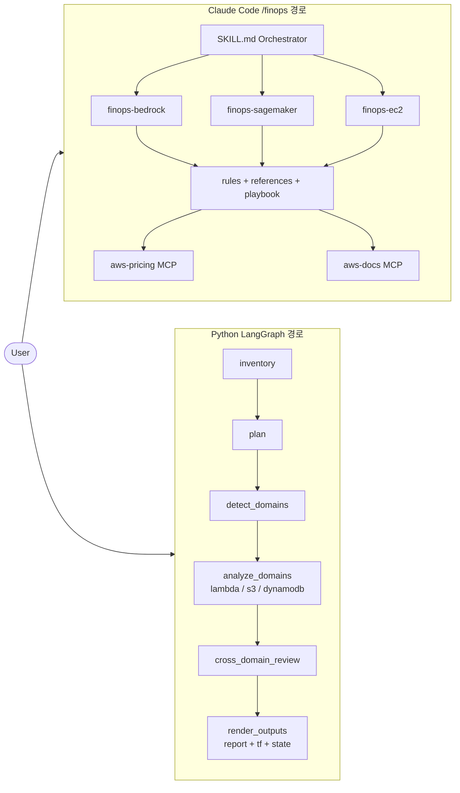
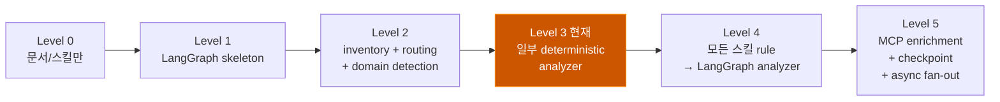
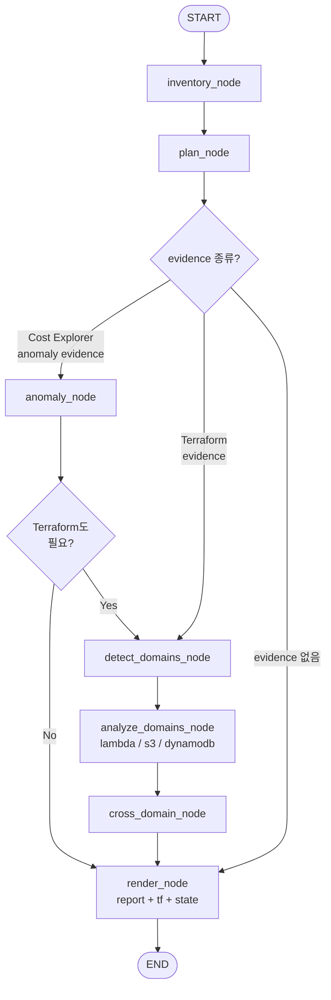
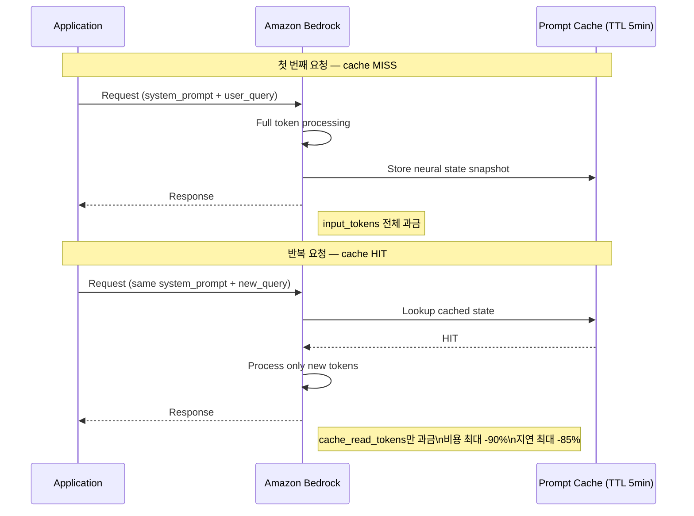
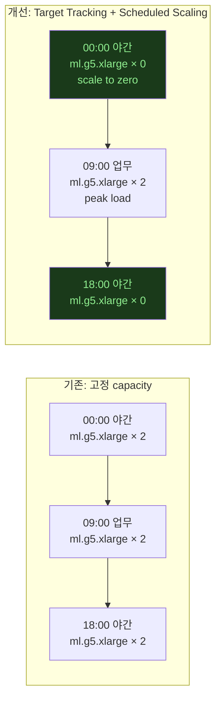
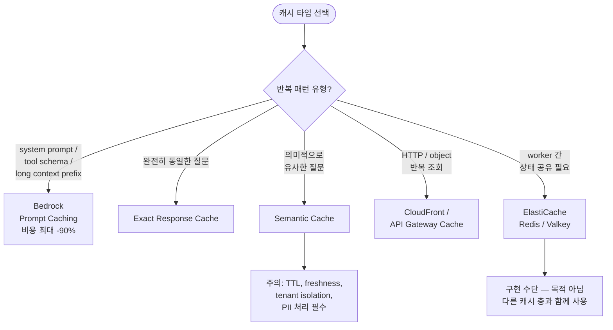
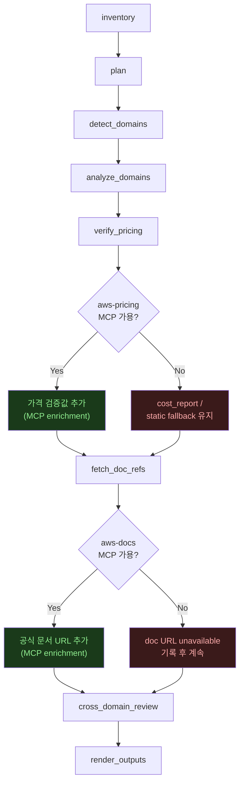
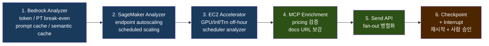

# 0615 CloudSweep: LangGraph 런타임과 GenAI FinOps 확장 정리

이 문서는 2026-06-15 기준 CloudSweep의 현재 구조, LangGraph 도입 수준, GenAI FinOps 스킬 추가 범위, MCP 연결 상태를 정리한다.


## 1. 전체 구조 한눈에 보기

현재 CloudSweep에는 두 실행 경로가 공존한다.

```text
User
├─ /finops  (Claude Code skill 경로)
│  └─ .claude/skills/finops/SKILL.md
│     └─ 서비스별 SKILL.md
│        ├─ finops-bedrock
│        ├─ finops-sagemaker
│        ├─ finops-ec2
│        └─ ...
│           └─ rules + references + playbook
│              └─ MCP 지침
│                 ├─ aws-pricing
│                 └─ aws-docs
│                    └─ Claude/subagent 기반 보고서
│
└─ python -m cloudsweep  (LangGraph 경로)
   └─ cloudsweep/graph.py
      └─ inventory → plan → detect_domains
         └─ built-in analyzer
            ├─ lambda
            ├─ s3
            └─ dynamodb
               └─ report + optimized tf + state json
```

중요한 점:

| 질문 | 현재 답 |
|------|---------|
| LangGraph가 `SKILL.md`를 읽어서 실행하나? | 아니다 |
| `SKILL.md`가 LangGraph를 호출하나? | 아니다 |
| 둘 중 더 완전한 분석 지식은 어디에 있나? | 현재는 `SKILL.md` + `rules` + `references` |
| 반복 실행 가능한 Python 엔진은 어디인가? | `cloudsweep/graph.py` |
| GenAI 분석은 어디까지 됐나? | 스킬/playbook은 추가됨, LangGraph built-in analyzer는 아직 미구현 |

**두 실행 경로 구조도:**



---

## 2. 현재 구현 상태

현재 LangGraph 수준은 **Level 3 초입**이다.

```text
Level 0: 문서/스킬만 있음
Level 1: LangGraph skeleton 있음
Level 2: inventory + routing + domain detection 됨
Level 3: 일부 deterministic analyzer 있음
Level 4: 모든 스킬 rule을 LangGraph analyzer로 대체
Level 5: MCP enrichment + checkpoint + interrupt + async fan-out
```

**구현 수준 진행도:**



현재 구현 표:

| 영역 | 상태 |
|------|------|
| CLI 실행 | 됨: `python -m cloudsweep <work_dir>` |
| Evidence inventory | 됨 |
| Execution plan | 됨 |
| Cost anomaly 분석 | 기본 spike detection 됨 |
| Terraform resource 파싱 | 됨 |
| Domain detection | 됨 |
| Built-in analyzer | `lambda`, `s3`, `dynamodb`만 있음 |
| Cross-domain note | 기본 note 생성 됨 |
| Report / optimized tf / state 출력 | 됨 |
| GenAI domain 감지 | 됨: `bedrock`, `sagemaker`, `ec2` |
| GenAI 실제 분석 | 아직 안 됨 |
| MCP pricing/docs | 아직 LangGraph 노드 아님 |
| Claude/LLM 호출 노드 | 아직 없음 |
| Send API 병렬 fan-out | 아직 없음 |
| checkpoint / interrupt | 아직 없음 |

현재 역할 분담:

| 역할 | 현재 담당 |
|------|-----------|
| 가장 완전한 분석 매뉴얼 | `SKILL.md` |
| 판정 기준 | `rules/*.json` |
| 상세 계산/운영 지침 | `references/details.md` |
| 여러 도메인이 공유하는 해법 | playbook |
| 반복 실행 가능한 Python 런타임 | `cloudsweep/graph.py` |
| 자동 분석 코드 | LangGraph built-in analyzer 일부 |

짧게 말하면:

> 스킬은 현재 더 똑똑한 분석 매뉴얼이고, LangGraph는 아직 덜 똑똑하지만 반복 실행 가능한 자동화 엔진이다.

---

## 3. LangGraph는 어떻게 들어가 있는가

현재 들어간 것은 **LangGraph 런타임**이다.  
CloudSweep에서는 LLM chain보다 **결정론적 FinOps workflow를 코드화하는 용도**로 사용한다.

파일:

```text
cloudsweep/
  __main__.py
  graph.py
requirements.txt
tests/
  test_graph_smoke.py
```

의존성:

```text
langgraph>=1.0,<2.0
```

실행:

```powershell
python -m cloudsweep sample\season2\MA-001 --dry-run
python -m cloudsweep sample\season2\MA-001
```

현재 그래프:

```text
START
  ↓
inventory
  ↓
plan
  ↓
execution_plan 분기
  ├─ Cost Explorer / anomaly evidence 있음
  │    ↓
  │  anomaly_analysis
  │    ↓
  │  Terraform domain analysis도 필요?
  │    ├─ yes → detect_domains
  │    └─ no  → render_outputs → END
  │
  ├─ Terraform evidence 있음
  │    ↓
  │  detect_domains
  │    ↓
  │  analyze_domains
  │    ↓
  │  cross_domain_review
  │    ↓
  │  render_outputs
  │    ↓
  │  END
  │
  └─ 분석 가능한 evidence 없음
       ↓
     render_outputs
       ↓
     END
```

**LangGraph 상태 머신 다이어그램:**



노드별 역할:

| 노드 | 역할 |
|------|------|
| `inventory_node` | `main.tf`, `metrics.json`, `cost_report.json`, Cost Explorer mock 파일 존재 여부 수집 |
| `plan_node` | evidence 기반으로 anomaly/domain/report 실행 계획 결정 |
| `anomaly_node` | Cost Explorer mock response에서 spike 탐지 |
| `detect_domains_node` | Terraform resource type으로 domain 목록 추출 |
| `analyze_domains_node` | 현재는 lambda/s3/dynamodb built-in analyzer 실행 |
| `cross_domain_node` | domain 조합에 따른 cross-service note 생성 |
| `render_node` | report, optimized tf, state json 생성 |

설계 원칙:

- 파싱, 라우팅, 통계 계산은 LLM 없이 deterministic Python으로 처리한다.
- LLM은 아직 노드에 넣지 않았다.
- 외부 의존성은 core 탐지 뒤의 enrichment 단계로 붙이는 것이 맞다.

---

## 4. GenAI FinOps 확장 범위

이번에 추가한 GenAI 스킬과 playbook은 **대상 AWS 워크로드의 비용**을 분석한다.

분석 대상:

| 대상 | 포함 여부 | 예 |
|------|-----------|----|
| 대상 앱의 Bedrock token 비용 | 포함 | 앱이 Bedrock Claude 모델 호출 |
| 대상 앱의 SageMaker endpoint 비용 | 포함 | `ml.g5.xlarge` endpoint 상시 running |
| 대상 앱의 EC2 GPU 비용 | 포함 | `g5.2xlarge` 학습 서버 미정지 |
| 대상 앱의 prompt cache / semantic cache 부재 | 포함 | 같은 context를 Bedrock에 반복 전송 |

---

## 5. 추가된 스킬과 해결하는 문제

```text
.claude/skills/
  finops-bedrock/
  finops-sagemaker/
  finops-ec2/
  finops/
    references/
      llm-tco-playbook.md
      genai-cache-playbook.md
```

### 5-1. `finops-bedrock`

대상 문제:

| 문제 | 설명 |
|------|------|
| On-Demand vs Provisioned Throughput break-even | token 과금이 약정형 처리량보다 비싼지 비교 |
| underutilized commitment | Provisioned Throughput 또는 reserved tier를 샀지만 사용률이 낮은 경우 |
| prompt caching 부재 | 반복되는 prompt prefix를 매번 input token으로 과금 |
| semantic cache 부재 | 비슷한 질문을 매번 Bedrock에 다시 호출 |
| LLM TCO 검토 | Bedrock API와 hosted inference를 비교해야 하는 경우 |

핵심 계산:

```text
on_demand_monthly =
  input_tokens_million  * input_price_per_1m_tokens
+ output_tokens_million * output_price_per_1m_tokens

committed_monthly =
  committed_units * hourly_price_per_unit * committed_hours_per_month

monthly_savings =
  on_demand_monthly - committed_monthly
```

Prompt cache와 semantic cache는 다르다.

| 구분 | 의미 |
|------|------|
| Prompt caching | 반복되는 system prompt, tool schema, long context 같은 input prefix 비용 절감 |
| Semantic cache | 유사 질문의 답변을 재사용해 모델 호출 자체를 줄임 |

**Bedrock Prompt Caching 요청 흐름:**



참고: [Amazon Bedrock 프롬프트 캐싱 효과적으로 활용하기](https://aws.amazon.com/ko/blogs/tech/effectively-use-prompt-caching-on-amazon-bedrock-kr)

주의:

- token spend가 높다고 바로 commitment를 추천하면 안 된다.
- traffic steadiness, p95/p99 latency, model/region support가 필요하다.
- semantic cache는 TTL, freshness, tenant isolation, PII 처리가 없으면 위험하다.

### 5-2. `finops-sagemaker`

대상 문제:

| 문제 | 설명 |
|------|------|
| target tracking 미설정 | endpoint variant가 고정 instance count로 계속 과금 |
| scheduled scaling 미설정 | 야간/주말 low traffic에도 GPU endpoint 유지 |
| GPU endpoint underutilization | GPU utilization은 낮지만 instance-hour는 계속 발생 |
| architecture mismatch | bursty workload인데 real-time endpoint로 상시 운영 |

핵심 계산:

```text
endpoint_instance_savings =
  (current_instance_count - target_instance_count)
  * instance_hourly_price
  * hours_reduced_per_month
```

**SageMaker Target Tracking vs 고정 capacity 비교:**



참고: [SageMaker Inference Scale to Zero](https://aws.amazon.com/blogs/machine-learning/unlock-cost-savings-with-the-new-scale-down-to-zero-feature-in-amazon-sagemaker-inference) · [Configuring Autoscaling Inference Endpoints](https://aws.amazon.com/blogs/machine-learning/configuring-autoscaling-inference-endpoints-in-amazon-sagemaker/)

주의:

- 평균 traffic만 보고 scale-in하면 안 된다.
- p95/p99 latency, model load time, GPU memory, errors/throttles를 같이 본다.
- 24x7 low-latency SLA가 있으면 zero capacity가 아니라 minimum safe capacity를 둔다.

### 5-3. `finops-ec2`

대상 문제:

| 문제 | 설명 |
|------|------|
| GPU 야간/주말 미정지 | `g*`, `p*` instance가 off-hours에도 running |
| Inferentia/Trainium 미스케줄링 | `inf*`, `trn*` accelerator instance 상시 과금 |
| ASG 고정 desired capacity | GPU fleet이 schedule/scaling 없이 유지 |
| residual cost 누락 | EC2 stop 후에도 EBS/EIP/snapshot 비용이 남음 |

핵심 계산:

```text
stopped_hours_per_month =
  off_hours_per_week * 4.345

gross_instance_savings =
  instance_count * instance_hourly_price * stopped_hours_per_month

net_savings =
  gross_instance_savings
- ebs_monthly
- eip_monthly
- snapshot_monthly
- scheduler_monthly
```

추천 remediation:

| 상황 | 권장 방식 |
|------|-----------|
| 여러 계정/리전에 넓게 적용 | Instance Scheduler on AWS |
| 단순 start/stop | Systems Manager Quick Setup schedule |
| 커스텀 워크플로 | EventBridge Scheduler + SSM Automation |
| ASG 기반 GPU fleet | ASG scheduled action |

---

## 6. `SKILL.md`와 playbook의 차이

둘 다 Markdown 문서지만 역할이 다르다.

```text
SKILL.md      = 담당 분석가의 출동 기준 + 업무 절차
rules/*.json  = 기계적으로 판정할 체크리스트
details.md    = 해당 서비스 안의 자세한 분석 매뉴얼
playbook      = 여러 스킬이 같이 보는 공통 해법/계산법
```

예시:

```text
/finops가 aws_bedrock* 리소스를 발견
  → finops-bedrock/SKILL.md 사용
  → Bedrock token, throughput, cache 문제 분석
  → API vs self-hosting 비교가 필요하면 llm-tco-playbook.md 참고
  → 어떤 cache가 맞는지 판단해야 하면 genai-cache-playbook.md 참고
```

즉:

```text
SKILL.md:
  "이 상황에서는 Bedrock 분석을 해라."

llm-tco-playbook.md:
  "Bedrock API와 hosted inference TCO는 이렇게 비교해라."

genai-cache-playbook.md:
  "prompt cache, exact cache, semantic cache, Redis cache 중 무엇이 맞는지 이렇게 고르라."
```

playbook은 독립적으로 출동하는 1차 탐지 엔진이 아니다.  
탐지된 리소스/비용 패턴을 어떻게 해석하고 어떤 대안을 비교할지 잡아주는 공통 기준이다.

---

## 7. 공통 playbook

### 7-1. `llm-tco-playbook.md`

역할: Bedrock API를 계속 쓸지, SageMaker/EC2 GPU/Inferentia로 직접 호스팅할지 비교하는 방법론.

비교 축:

| 항목 | Managed API | Hosted inference |
|------|-------------|------------------|
| 대표 서비스 | Bedrock token API | SageMaker endpoint, EC2 GPU, Inferentia |
| 비용 단위 | input/output token | instance-hour + ops |
| 장점 | 운영 부담 낮음, model switching 쉬움 | steady high-volume에서 단가가 낮아질 수 있음 |
| 단점 | 대량 token에서 비용 증가 | idle capacity, 운영, patching, benchmark 필요 |

Managed API 비용:

```text
api_monthly =
  input_tokens_million  * input_price_per_1m
+ output_tokens_million * output_price_per_1m
+ cache_write_tokens_million * cache_write_price_per_1m
+ cache_read_tokens_million  * cache_read_price_per_1m
+ commitment_or_reserved_capacity
```

Hosted inference 비용:

```text
hosted_monthly =
  accelerator_instance_hours * instance_hourly_price
+ endpoint_orchestrator_cost
+ storage_cost
+ data_transfer_cost
+ logging_monitoring_cost
+ engineering_ops_cost
- covered_discount
```

원칙:

- GPU가 있다고 자체 호스팅이 자동으로 싼 것은 아니다.
- benchmark throughput, utilization, idle capacity, 운영비를 같이 계산한다.
- traffic이 steady하고 high-volume일수록 hosted inference 검토 가치가 커진다.

### 7-2. `genai-cache-playbook.md`

역할: GenAI cache를 어떤 층에서 적용할지 고르는 기준.

| 패턴 | 적합한 캐시 |
|------|-------------|
| 같은 system prompt / tool schema / long context 반복 | Bedrock prompt caching |
| 동일 질문 반복 | exact response cache |
| 비슷한 질문 반복 | semantic cache |
| HTTP/object origin 반복 조회 | CloudFront / API cache |
| 여러 worker가 cache state를 공유해야 함 | ElastiCache / Redis / Valkey |

**캐시 타입 선택 의사결정 트리:**



중요한 분리:

- Prompt cache는 **input prefix 비용 절감**이다.
- Semantic cache는 **모델 호출 자체를 피하는 응답 재사용**이다.
- ElastiCache는 목적이 아니라 구현 수단이다.

---

## 8. 오케스트레이터 변경

### 8-1. Domain detection 확장

추가된 domain:

```text
aws_bedrock*, aws_bedrockagent*  → bedrock    → finops-bedrock
aws_sagemaker*                  → sagemaker  → finops-sagemaker
aws_instance / launch_template / ASG with accelerator evidence
                                  → ec2       → finops-ec2
```

LangGraph에도 반영:

```python
DOMAIN_KEYWORDS = {
    "bedrock": ("aws_bedrock*", "aws_bedrockagent*"),
    "sagemaker": ("aws_sagemaker*",),
    "ec2": ("aws_instance", "aws_launch_template", "aws_autoscaling_group", "aws_spot_instance_request"),
}
```

Bedrock은 provider resource 이름이 계속 늘어날 수 있어 wildcard 매칭을 추가했다.

### 8-2. Cost alias 확장

`references/domain-aliases.md`와 `SERVICE_ALIASES`에 추가:

```text
bedrock   → Bedrock, Amazon Bedrock
sagemaker → SageMaker, Amazon SageMaker, Amazon SageMaker AI
ec2       → EC2, Amazon EC2, Amazon Elastic Compute Cloud
```

목적: `cost_report.json`의 서비스명이 조금 달라도 domain별 cost slice를 만들 수 있게 하기.

### 8-3. Cross-service pattern 추가

| Pattern | Surface | Driver |
|---------|---------|--------|
| Bedrock repeated prompt context | Bedrock input tokens | Missing prompt caching |
| Bedrock repeated/similar query | Bedrock input/output tokens | Missing semantic cache |
| SageMaker endpoint fixed GPU capacity | SageMaker instance-hours | Missing target tracking or schedule |
| EC2 GPU off-hours | EC2 instance-hours | Missing Instance Scheduler/SSM schedule |

예시:

```text
사용자 요청
  → Lambda/ECS app
  → Bedrock 호출
  → 반복 context 때문에 input token 증가
  → prompt cache / semantic cache 없음
  → Bedrock token 비용 증가
```

```text
야간 low traffic
  → SageMaker endpoint min capacity 유지
  → GPU instance-hour 계속 발생
  → target tracking / scheduled scaling 없음
```

---

## 9. MCP 연결 상태

현재 허용된 MCP 도구:

```text
mcp__aws-docs__search_documentation
mcp__aws-pricing__get_pricing_service_codes
mcp__aws-pricing__get_pricing
```

현재 상태:

| 경로 | MCP 사용 |
|------|----------|
| Claude Code `/finops` 스킬 경로 | 사용하도록 지시됨 |
| Python LangGraph 경로 | 아직 사용 안 함 |
| `python -m cloudsweep ...` | MCP 호출 없음 |

즉 MCP는 아직 LangGraph 노드가 아니다.

향후 연결 추천 구조:

```text
inventory
  ↓
plan
  ↓
detect_domains
  ↓
analyze_domains
  ↓
verify_pricing
  ├─ aws-pricing MCP 사용 가능 → 가격 검증값 추가
  └─ MCP 불가 → cost_report 또는 static fallback 유지
  ↓
fetch_doc_refs
  ├─ aws-docs MCP 사용 가능 → 공식 문서 URL 추가
  └─ MCP 불가 → doc URL unavailable 기록
  ↓
cross_domain_review
  ↓
render_outputs
```

원칙:

| 단계 | 원칙 |
|------|------|
| 탐지 | 로컬 evidence + rules로 결정 |
| 가격 검증 | MCP enrichment |
| 문서 링크 | MCP enrichment |
| MCP 실패 | fallback으로 report 계속 생성 |

MCP를 core 탐지 앞에 두면 외부 실패가 분석 전체를 막을 수 있다.  
따라서 finding 생성 후 검증/보강 단계로 두는 것이 맞다.

**MCP 연결 후 전체 노드 흐름:**



---

## 10. 다음 구현 순서

우선순위:

```text
1. Bedrock analyzer
   └─ token usage / PT break-even / prompt cache / semantic cache
      ↓
2. SageMaker analyzer
   └─ endpoint autoscaling / scheduled scaling
      ↓
3. EC2 accelerator scheduler analyzer
   └─ GPU/Inferentia/Trainium off-hour scheduling
      ↓
4. MCP enrichment nodes
   └─ pricing 검증 + docs URL 보강
      ↓
5. Send API fan-out
   └─ domain analyzer 병렬화
      ↓
6. checkpoint + interrupt
   └─ 재시작 가능성 + 사람 승인 지점
```

**구현 로드맵:**



### 10-1. Bedrock analyzer

가장 먼저 구현할 대상.

이유:

- Terraform 없이 cost/usage 중심으로 분석 가능하다.
- prompt cache, semantic cache, PT break-even 모두 rule JSON이 준비되어 있다.

구현 범위:

```text
input/output tokens
request count
repeated prefix tokens
cache read/write token evidence
cost_report Bedrock spend
On-Demand vs commitment break-even
prompt cache / semantic cache opportunity
```

### 10-2. SageMaker analyzer

구현 범위:

```text
aws_sagemaker_endpoint
aws_sagemaker_endpoint_configuration
production variants
initial_instance_count
aws_appautoscaling_target/policy 매칭
target tracking / scheduled scaling 누락 판정
```

### 10-3. EC2 accelerator scheduler analyzer

구현 범위:

```text
g*, p*, inf*, trn* instance family 감지
schedule tag/control 존재 여부 확인
Instance Scheduler / SSM / EventBridge / ASG scheduled action 감지
off-hour savings + residual cost 계산
```

### 10-4. MCP enrichment nodes

구현 범위:

```text
verify_pricing:
  findings의 service_code 기반 가격 검증
  cost_report 우선, MCP 보강, static fallback

fetch_doc_refs:
  remediation별 AWS 공식 문서 URL 추가
  MCP 실패 시 doc URL unavailable로 기록
```

---

## 11. 검증 명령

```powershell
python -m unittest discover -s tests
python -m cloudsweep sample\season2\MA-001 --dry-run
```

현재 확인된 결과:

```text
unittest discover -s tests → 3 tests OK
MA-001 dry-run → lambda, s3, dynamodb domain 분석 정상
GenAI smoke test → bedrock, sagemaker, ec2 domain 감지 정상
```
