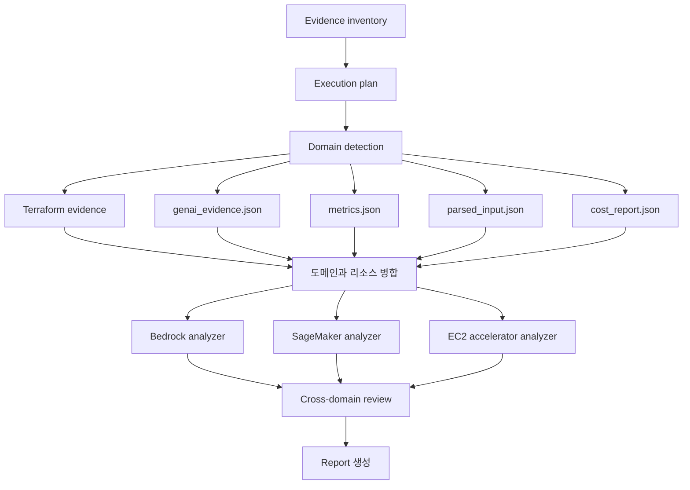

# 0622 CloudSweep: GenAI 입력 계약과 분석기 구현 정리

이 문서는 2026-06-22 기준으로 CloudSweep에 추가한 작업을 쉽게 설명한다.

이번 작업의 핵심은 다음 한 문장으로 정리할 수 있다.

> Terraform이 없어도 GenAI 비용 자료를 읽고, Bedrock·SageMaker·EC2 가속기 비용 문제를 자동으로 찾아내는 실행 가능한 분석기를 만들었다.

---

## 1. 이번에 무엇을 했나

`0615.md`에서 다음 구현 순서를 정했다.

```text
1. GenAI 입력 형식과 샘플 확정
2. Terraform 없는 입력도 분석하도록 라우팅 확장
3. Bedrock 분석기 구현
4. SageMaker 분석기 구현
5. EC2 accelerator 분석기 구현
```

이번 작업에서 위 1~5번을 모두 구현했다.

| 작업 | 결과 |
|------|------|
| GenAI 입력 계약 | `schemas/genai-evidence.schema.json` 추가 |
| Terraform 없는 샘플 | `sample/season2/GENAI-001/` 추가 |
| 비 Terraform 라우팅 | `genai_evidence.json`, metrics, parsed input, cost report 지원 |
| Bedrock 분석기 | B1~B4 규칙 구현 |
| SageMaker 분석기 | SM1~SM4 규칙 구현 |
| EC2 가속기 분석기 | EC2G1~EC2G4 규칙 구현 |
| 중복 절감액 처리 | 같은 리소스의 대안은 가장 큰 금액만 합산 |
| 테스트 | 총 10개 통과 |

---

## 2. 구현 전과 구현 후의 차이

### 구현 전

LangGraph는 GenAI 도메인의 이름만 알아볼 수 있었다.

```text
main.tf에서 Bedrock 리소스 발견
  → bedrock 도메인 감지
  → "아직 분석기가 없음" 경고
  → finding은 생성하지 못함
```

또한 `main.tf`가 없으면 도메인 분석 단계로 들어가지 못했다.

Bedrock처럼 Terraform보다 token 사용량과 비용 자료가 더 중요한 서비스에는 큰 제약이었다.

### 구현 후

이제 여러 evidence를 함께 읽어 도메인을 찾는다.

```text
genai_evidence.json 또는 metrics.json 또는 cost_report.json
  → bedrock / sagemaker / ec2 도메인 감지
  → 해당 built-in analyzer 실행
  → 규칙별 finding 생성
  → 절감액과 근거를 보고서에 출력
```

현재 실행 흐름은 다음과 같다.



---

## 3. 추가하거나 변경한 주요 파일

```text
cloudsweep/
  graph.py
    - GenAI evidence 로딩
    - 비 Terraform 라우팅
    - Bedrock 분석기
    - SageMaker 분석기
    - EC2 accelerator 분석기
    - 보수적 절감액 합산

schemas/
  genai-evidence.schema.json

sample/season2/GENAI-001/
  README.md
  genai_evidence.json
  cost_report.json

tests/
  test_graph_smoke.py
  test_genai_analyzers.py

README.md
  - GenAI 입력 방법과 built-in analyzer 범위 설명
```

`0615.md`는 당시 상태를 기록한 문서이므로 그대로 두었다.

---

## 4. GenAI 입력 계약

### 4-1. 왜 별도 입력 계약이 필요한가

기존 분석기는 주로 Terraform과 CloudWatch 형태의 metrics를 사용했다.

하지만 GenAI 비용 분석에는 다음처럼 Terraform만으로 알 수 없는 값이 필요하다.

- Bedrock input/output token 수
- 반복되는 prompt prefix 크기
- cache read/write token 수
- 유사 질문 비율
- SageMaker GPU 사용률과 endpoint 요청량
- EC2 GPU의 야간·주말 미사용 시간
- EBS, EIP, snapshot 같은 잔여 비용

그래서 `genai_evidence.json`이라는 명확한 입력 형식을 추가했다.

정식 JSON Schema는 다음 파일에 있다.

```text
schemas/genai-evidence.schema.json
```

### 4-2. 최상위 구조

```json
{
  "schema_version": "1.0",
  "metadata": {
    "period_start": "2026-05-01",
    "period_end": "2026-05-03",
    "period_days": 3,
    "resolution": "daily",
    "region": "us-east-1",
    "currency": "USD"
  },
  "resources": {
    "resource-name": {
      "service": "bedrock",
      "resource_type": "aws_bedrock_model_usage",
      "configuration": {},
      "metrics": {},
      "costs": {}
    }
  }
}
```

중요한 필드는 다음과 같다.

| 필드 | 의미 |
|------|------|
| `schema_version` | 입력 형식 버전. 현재는 `1.0` |
| `metadata` | 관측 기간, 해상도, 리전, 통화 |
| `resources` | 분석할 리소스 목록 |
| `service` | `bedrock`, `sagemaker`, `ec2` 중 하나 |
| `resource_type` | 리소스 종류 또는 사용량 record 종류 |
| `configuration` | cache, scaling, schedule 같은 현재 구성 |
| `metrics` | token, request, GPU 사용률 같은 관측값 |
| `costs` | 단가와 월 비용, 잔여 비용 |

### 4-3. Metric 형식

모든 metric은 같은 모양을 사용한다.

```json
{
  "gpu_utilization_pct": {
    "unit": "Percent",
    "datapoints": [8.0, 12.0, 9.0]
  }
}
```

이렇게 통일하면 평균, p95, 합계 같은 통계를 공통 함수로 계산할 수 있다.

### 4-4. 서비스별 주요 입력

#### Bedrock

```text
model_id
input_tokens
output_tokens
requests
traffic_tokens_per_minute
repeated_prefix_tokens
repeated_requests_per_day
cache_read_tokens
cache_write_tokens
similar_query_rate_pct
expected_cache_hit_rate_pct
input/output/cache 가격
commitment 가격과 처리량
```

#### SageMaker

```text
endpoint_name
variant_name
instance_type
instance_count
autoscaling target/policy 존재 여부
scheduled scaling 존재 여부
invocations_per_instance
GPU/GPU memory 사용률
model latency
errors
instance 시간당 가격
```

#### EC2 accelerator

```text
instance_type
instance_count
workload_role
schedule control 존재 여부
off_hours_per_week
GPU/CPU 사용률
instance 시간당 가격
EBS/EIP/snapshot/scheduler 잔여 비용
```

### 4-5. 잘못된 입력 처리

런타임에서도 입력을 검사한다.

예를 들어 다음을 확인한다.

- `schema_version`이 `1.0`인지
- metadata 필수 필드가 있는지
- service 값이 올바른지
- metric datapoint가 숫자인지
- Bedrock에 `model_id`가 있는지
- SageMaker에 endpoint와 instance 정보가 있는지
- EC2 instance type이 `g`, `p`, `inf`, `trn` 계열인지

입력이 일부 잘못되었다고 그래프 전체를 중단하지는 않는다.

```text
잘못된 입력 발견
  → Warnings에 문제 기록
  → 읽을 수 있는 evidence로 분석 계속
```

이는 하나의 evidence 오류 때문에 전체 보고서가 사라지는 것을 막기 위한 동작이다.

---

## 5. Terraform 없는 라우팅

### 5-1. 이전 문제

기존 실행 계획은 Terraform이 있을 때만 `domain_analysis`를 추가했다.

```python
if evidence.get("terraform"):
    plan.append("domain_analysis")
```

따라서 token 사용량과 cost report만 있는 Bedrock workload는 분석되지 않았다.

### 5-2. 변경된 기준

이제 다음 중 하나만 있어도 domain 분석을 시도한다.

```text
main.tf
genai_evidence.json
metrics.json
parsed_input.json
cost_report.json
```

각 evidence에서 발견한 domain과 리소스는 하나로 병합한다.

예를 들어 다음 두 자료가 같이 있을 수 있다.

```text
genai_evidence.json
  → orders-assistant라는 Bedrock route 발견

cost_report.json
  → Amazon Bedrock 월 비용 발견
```

최종 결과는 다음처럼 합쳐진다.

```text
bedrock domain resources:
  - orders-assistant
  - cost:Amazon Bedrock
```

동일한 리소스 이름은 중복으로 추가하지 않는다.

### 5-3. Cost service alias

cost report의 서비스 이름은 데이터마다 조금씩 다를 수 있다.

```text
Bedrock
Amazon Bedrock

SageMaker
Amazon SageMaker
Amazon SageMaker AI

EC2
Amazon EC2
Amazon Elastic Compute Cloud
```

이 이름들을 각각 `bedrock`, `sagemaker`, `ec2` domain으로 정규화한다.

---

## 6. Bedrock 분석기

Bedrock 분석기는 네 가지 규칙을 처리한다.

### 6-1. B1: On-Demand와 commitment 손익분기

Rule ID:

```text
BEDROCK_B1_THROUGHPUT_COMMIT
```

먼저 On-Demand 비용을 계산한다.

```text
on_demand_monthly =
  input_tokens_million × input_price_per_1m_tokens
+ output_tokens_million × output_price_per_1m_tokens
```

commitment 비용은 다음과 같이 계산한다.

```text
committed_monthly =
  committed_units × hourly_price_per_unit × committed_hours_per_month
```

단순히 commitment가 싸다고 finding을 만들지는 않는다.

다음 조건을 모두 확인한다.

- 관측 기간이 14일 이상
- traffic 변동계수(CV)가 0.35 이하
- commitment 유효 사용률이 60% 이상
- 예상 절감률이 10% 이상
- 해당 model/region이 commitment를 지원
- latency 또는 throughput 요구가 실제로 존재

즉, 잠깐 사용량이 높았다는 이유로 장기 약정을 추천하지 않는다.

### 6-2. B2: 사용하지 못하는 commitment

Rule ID:

```text
BEDROCK_B2_UNDERUTILIZED_COMMITMENT
```

이미 commitment가 있는데 실제 사용률이 40% 미만이면 finding을 만든다.

```text
wasted_commitment =
  committed_monthly × (1 - effective_utilization)
```

다만 active commitment를 즉시 해지하라고 권하지 않는다.

다음을 먼저 검토하도록 보고한다.

- commitment 만료일
- traffic routing
- 다음 갱신 시점의 용량 조정
- model과 region 변경 계획

### 6-3. B3: Prompt caching 부재

Rule ID:

```text
BEDROCK_B3_MISSING_PROMPT_CACHE
```

다음 조건이면 prompt cache 기회로 본다.

- 반복 prefix가 요청당 1,024 token 이상
- 반복 요청이 하루 100회 이상
- cache read token이 0
- model이 prompt caching을 지원

반복 prefix는 다음과 같은 부분이다.

```text
system prompt
tool schema
정책 문서
few-shot example
반복되는 긴 context
```

표준 input 가격과 cache read/write 가격이 모두 있을 때만 절감액을 계산한다.

가격이 부족하면 finding은 만들되 confidence를 `LOW`로 낮추고 절감액을 임의로 만들지 않는다.

### 6-4. B4: Semantic cache 부재

Rule ID:

```text
BEDROCK_B4_MISSING_SEMANTIC_CACHE
```

다음 조건을 확인한다.

- 유사 질문 비율 15% 이상
- 예상 cache hit rate 30% 이상
- semantic cache가 없음
- 월 Bedrock 비용이 500달러 이상

절감액은 다음 개념으로 계산한다.

```text
avoidable_llm_cost =
  현재 Bedrock 비용 × 예상 cache hit rate

semantic_cache_cost =
  embedding 요청 비용
  + cache node 비용
  + network/storage 비용

net_savings =
  avoidable_llm_cost - semantic_cache_cost
```

semantic cache는 잘못된 답을 재사용할 위험이 있다.

그래서 recommendation에 다음 안전 조건을 반드시 포함한다.

- similarity threshold
- TTL과 invalidation
- tenant isolation
- PII 처리
- Bedrock fallback

---

## 7. SageMaker 분석기

SageMaker 분석기는 Terraform과 `genai_evidence.json`을 모두 사용할 수 있다.

Terraform에서는 다음 연결을 추적한다.

```text
aws_sagemaker_endpoint
  → aws_sagemaker_endpoint_configuration
     → production variant

endpoint / variant
  → aws_appautoscaling_target
  → aws_appautoscaling_policy
  → aws_appautoscaling_scheduled_action
```

### 7-1. SM1: Target tracking 부재

Rule ID:

```text
SAGEMAKER_SM1_MISSING_TARGET_TRACKING
```

production variant의 instance count가 2개 이상인데 target이나 policy가 빠져 있으면 finding을 만든다.

target만 있고 policy가 없어도 불완전한 설정이다.

반대로 target과 policy가 endpoint/variant에 정확히 연결되어 있으면 SM1은 발생하지 않는다.

### 7-2. SM2: Scheduled scaling 부재

Rule ID:

```text
SAGEMAKER_SM2_MISSING_SCHEDULED_SCALING
```

예측 가능한 low-traffic 시간이 있는데 scheduled scaling이 없으면 finding을 만든다.

```text
scheduled_savings =
  reduced_instances
  × instance_hourly_price
  × off_hours_per_month
```

24시간 낮은 latency가 필요하면 0으로 내리는 대신 `minimum_safe_capacity`를 유지한다.

### 7-3. SM3: GPU endpoint 저활용

Rule ID:

```text
SAGEMAKER_SM3_GPU_UNDERUTILIZED
```

다음 조건을 함께 본다.

- GPU 또는 accelerator instance
- 평균 GPU 사용률 25% 미만
- p95 GPU memory 사용률 60% 미만
- latency SLA에 25% 이상 여유
- error가 0

평균 GPU 사용률 하나만 보고 instance를 줄이지 않는다.

다음 검증을 recommendation에 포함한다.

- p95/p99 latency
- GPU memory
- errors와 throttles
- model load time
- canary 또는 shadow test

instance가 한 개뿐이고 더 작은 instance 가격 근거가 없으면 절감액을 0으로 둔다.

유일한 production instance를 없앤 것으로 계산하지 않기 위한 안전장치다.

### 7-4. SM4: Bursty workload의 always-on endpoint

Rule ID:

```text
SAGEMAKER_SM4_BURSTY_ALWAYS_ON_ENDPOINT
```

요청량이 매우 낮고 strict low-latency SLA가 없으면 architecture review를 제안한다.

검토 대상은 다음과 같다.

```text
Async Inference
Serverless Inference
Batch Transform
Bedrock
예약 시간에만 endpoint 운영
```

이 규칙은 실제 benchmark 없이 절감액을 단정할 수 없으므로 confidence와 절감액을 낮게 둔다.

---

## 8. EC2 accelerator 분석기

다음 instance family를 accelerator로 본다.

```text
g*   GPU
p*   GPU
inf* Inferentia
trn* Trainium
```

Terraform에서는 다음을 분석한다.

```text
aws_instance
aws_launch_template
aws_autoscaling_group
aws_autoscaling_schedule
aws_scheduler_schedule
aws_cloudwatch_event_rule
aws_ssm_association
```

### 8-1. EC2G1: 스케줄 없는 accelerator

Rule ID:

```text
EC2G1_UNSCHEDULED_ACCELERATOR
```

off-hours가 주 40시간 이상이고 schedule control이 없으면 finding을 만든다.

추천 방식은 환경에 따라 달라진다.

| 환경 | 추천 방식 |
|------|-----------|
| 여러 계정과 리전 | Instance Scheduler on AWS |
| 단순 start/stop | SSM Quick Setup |
| 커스텀 작업 순서 | EventBridge Scheduler + SSM |
| ASG fleet | ASG scheduled action |

### 8-2. EC2G2: Idle dev/training GPU

Rule ID:

```text
EC2G2_IDLE_DEV_TRAINING_ACCELERATOR
```

workload가 `dev`, `training`, `notebook`이고 GPU 사용률이 20% 미만이면 더 구체적인 이 규칙을 사용한다.

같은 리소스에 EC2G1과 EC2G2를 동시에 만들지 않는다.

더 구체적이고 confidence가 높은 EC2G2를 우선한다.

### 8-3. EC2G3: 고정 GPU ASG capacity

Rule ID:

```text
EC2G3_FIXED_GPU_ASG_CAPACITY
```

accelerator launch template을 사용하는 ASG가 고정 desired capacity를 유지하고 schedule/scaling이 없으면 finding을 만든다.

테스트에서는 ASG scheduled action을 추가했을 때 이 finding이 사라지는 것까지 확인했다.

### 8-4. EC2G4: 잔여 비용 정보 부족

Rule ID:

```text
EC2G4_RESIDUAL_COSTS_UNKNOWN
```

EC2를 중지해도 다음 비용은 남을 수 있다.

```text
EBS
Elastic IP
snapshot
scheduler
NAT
data transfer
```

따라서 잔여 비용 자료가 없으면 순절감액을 확정하지 않고 INFO finding을 추가한다.

EC2 순절감액 계산은 다음과 같다.

```text
stopped_hours_per_month =
  off_hours_per_week × 4.345

gross_instance_savings =
  instance_count
  × instance_hourly_price
  × stopped_hours_per_month

net_savings =
  gross_instance_savings
  - EBS
  - EIP
  - snapshot
  - scheduler
```

---

## 9. 절감액 중복 합산 방지

한 리소스에서 여러 finding이 동시에 나올 수 있다.

예를 들어 SageMaker endpoint 하나에 다음 세 finding이 생길 수 있다.

```text
SM1 target tracking 부재       $506.88
SM2 scheduled scaling 부재    $506.88
SM3 GPU 저활용              $1,027.84
```

이 세 금액을 모두 더하면 같은 instance-hour 절감을 여러 번 계산할 위험이 있다.

그래서 GenAI finding에 `savings_group`을 추가했다.

```text
sagemaker:orders-realtime
```

같은 group에서는 가장 큰 금액 하나만 전체 절감액에 포함한다.

```text
SageMaker 전체 반영액 = max(506.88, 506.88, 1027.84)
                      = 1027.84
```

Bedrock과 EC2도 같은 원칙을 적용한다.

보고서에는 이 값을 다음 이름으로 표시한다.

```text
Conservative estimated monthly savings
```

즉, 가능한 모든 대안을 무조건 더한 공격적인 수치가 아니라 중복을 피한 보수적 추정치다.

---

## 10. GENAI-001 샘플 결과

샘플 위치:

```text
sample/season2/GENAI-001/
```

이 샘플에는 `main.tf`가 없다.

```text
genai_evidence.json
cost_report.json
```

두 파일만으로 다음 domain을 감지한다.

```text
bedrock
sagemaker
ec2
```

실행 결과 finding은 다음과 같다.

| Rule | 내용 | Confidence | 개별 월 절감액 |
|------|------|------------|----------------|
| `BEDROCK_B3_MISSING_PROMPT_CACHE` | Prompt cache 부재 | MEDIUM | $197.80 |
| `BEDROCK_B4_MISSING_SEMANTIC_CACHE` | Semantic cache 부재 | MEDIUM | $433.37 |
| `SAGEMAKER_SM1_MISSING_TARGET_TRACKING` | Target tracking 부재 | HIGH | $506.88 |
| `SAGEMAKER_SM2_MISSING_SCHEDULED_SCALING` | Scheduled scaling 부재 | MEDIUM | $506.88 |
| `SAGEMAKER_SM3_GPU_UNDERUTILIZED` | GPU 저활용 | MEDIUM | $1,027.84 |
| `SAGEMAKER_SM4_BURSTY_ALWAYS_ON_ENDPOINT` | Always-on 구조 검토 | LOW | $0.00 |
| `EC2G2_IDLE_DEV_TRAINING_ACCELERATOR` | Training GPU 미스케줄링 | HIGH | $324.98 |

같은 리소스의 중복 가능 금액을 제거하면 다음과 같다.

```text
Bedrock group   max(197.80, 433.37) = 433.37
SageMaker group max(506.88, 506.88, 1027.84, 0) = 1027.84
EC2 group       324.98

보수적 월 예상 절감액 = 433.37 + 1027.84 + 324.98
                      = $1,786.19
```

이 금액은 sample에 들어 있는 static price와 workload 가정을 사용한 값이다.

실제 변경 전에는 AWS 실가격, private pricing, Savings Plans, model/region 지원 여부를 다시 검증해야 한다.

---

## 11. 테스트한 내용

현재 총 14개 테스트가 통과한다.

### 기존 회귀 테스트

| 테스트 | 확인 내용 |
|--------|-----------|
| MA-001 | Lambda, S3, DynamoDB 6개 finding 유지 |
| LV-001 | Cost anomaly node 정상 실행 |
| Terraform GenAI 감지 | Bedrock, SageMaker, EC2 감지 |
| 비 Terraform GenAI 감지 | GENAI-001이 domain analysis로 진입 |
| 잘못된 GenAI 입력 | 중단하지 않고 warning 생성 |
| metrics + cost report | Terraform 없이 domain 감지 |
| parsed input | Terraform 없이 EC2 domain 감지 |

### 새 analyzer 테스트

| 테스트 | 확인 내용 |
|--------|-----------|
| Bedrock commitment | B1 절감액 $293.00 계산 |
| Bedrock underutilization | B2 낭비액 $584.00 계산 |
| SageMaker Terraform | target/policy가 없거나 하나만 없으면 SM1 발생 |
| SageMaker 완료 구성 | target과 policy가 모두 있으면 SM1 제거 |
| EC2 GPU ASG | schedule 없으면 G1/G3/G4 발생 |
| EC2 scheduled action | schedule 추가 후 해당 finding 제거 |
| 절감액 grouping | GENAI-001 보수적 합계 $1,786.19 확인 |

### Runtime architecture 테스트

| 테스트 | 확인 내용 |
|--------|-----------|
| Send fan-out | 세 domain branch와 결과 순서 확인 |
| MCP adapter | 가격 검증과 공식 문서 URL 보강 확인 |
| MCP failure | finding을 유지하고 local fallback 사용 |
| checkpoint/interrupt | 승인 지점에서 중단되는지 확인 |
| Command resume | 같은 thread state를 복원해 승인 후 완료 |

검증 명령:

```powershell
python -m unittest discover -s tests -v
python -m cloudsweep sample\season2\GENAI-001 --dry-run
python -m cloudsweep sample\season2\MA-001 --dry-run
```

확인된 결과:

```text
14 tests OK

GENAI-001
  Intent: waste_optimization
  Plan: domain_analysis -> report
  Domains: bedrock, sagemaker, ec2
  Findings: 7

MA-001
  Domains: lambda, s3, dynamodb
  Findings: 6
```

Python 문법, JSON 문법, `git diff --check`도 통과했다.

---

## 12. 실행 방법

### 결과 파일을 만들지 않고 확인

```powershell
python -m cloudsweep sample\season2\GENAI-001 --dry-run
```

### 결과 파일 생성

```powershell
python -m cloudsweep sample\season2\GENAI-001
```

기본 출력:

```text
sample/season2/GENAI-001/result/
  cloudsweep_graph_report.md
  cloudsweep_main_optimized.tf
  cloudsweep_graph_state.json
```

### 표준 파일명 사용

```powershell
python -m cloudsweep sample\season2\GENAI-001 --standard-output
```

```text
result/finops_report.md
result/main_optimized.tf
result/cloudsweep_graph_state.json
```

---

## 13. 6~8번 Runtime Architecture

1~5번 구현 뒤 다음 runtime 구조도 추가했다.

```text
6. MCP enrichment architecture
   - pricing/docs provider interface
   - local fallback
   - callable MCP adapter

7. Send API fan-out
   - domain별 병렬 branch
   - reducer와 deterministic collect

8. checkpoint + interrupt
   - InMemorySaver 기반 checkpoint
   - 고비용·LOW confidence 승인 중단
   - Command(resume=...) 재개
```

전체 설계와 사용 예시는 `ARCHITECTURE.md`에 정리했다.

현재 실제 AWS MCP transport와 운영용 durable checkpoint DB는 배포 환경에서 연결해야 한다.

현재 분석기는 deterministic Python 코드다.

```text
LLM이 느낌으로 판정하는 구조가 아님
입력 evidence + 명시된 threshold + 계산식으로 판정
```

현재 가격도 MCP가 실시간 검증한 값이 아니다.

```text
우선순위 1: genai_evidence의 scenario 가격
우선순위 2: cost_report 가격
없음: pricing_source=unavailable, 절감액을 0 또는 낮은 confidence로 처리
```

MCP 검증 노드는 실제로 analyzer와 result collect 뒤에 배치했다. 따라서 MCP가 실패해도 deterministic finding과 보고서는 유지된다.

---

## 14. 최종 상태

```text
Level 3 초입
  - Lambda/S3/DynamoDB analyzer

          ↓ 이번 작업

Level 4 진행
  - Bedrock analyzer 완료
  - SageMaker analyzer 완료
  - EC2 accelerator analyzer 완료
  - Terraform 없는 GenAI evidence 지원
  - 입력 계약과 검증 추가
  - 보수적 절감액 집계 추가

          ↓ 추가 runtime architecture

Level 5 구조 구현
  - MCP enrichment provider + fallback
  - Send API domain fan-out
  - checkpoint + interrupt + resume
  - 실제 MCP transport와 durable DB는 배포 시 연결
```

짧게 정리하면 다음과 같다.

> CloudSweep는 이제 GenAI 리소스의 이름만 찾는 단계가 아니라, 실제 token·GPU·스케줄·비용 근거를 계산해 finding을 만드는 단계까지 올라왔다.
