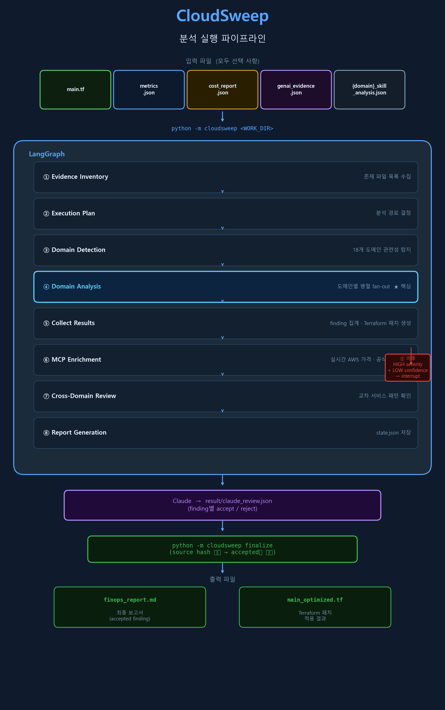
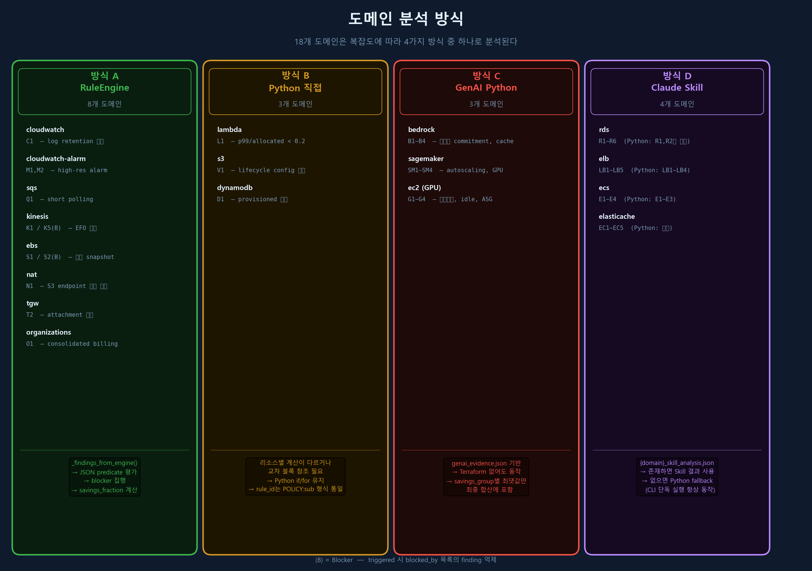
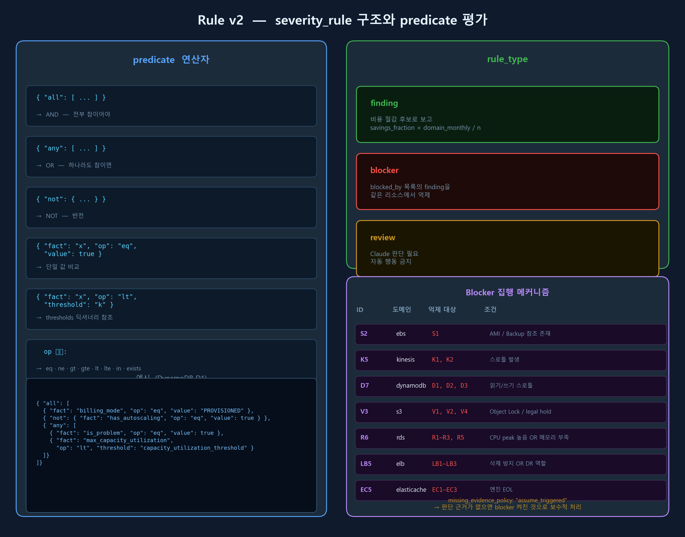

# CloudSweep 현재 구조 정리 (2026-06-22)

---

## 1. 한 줄 요약

> Terraform이 없어도 AWS 18개 도메인의 비용 낭비를 자동으로 찾고, 안전 조건을 확인한 뒤, Terraform 패치와 절감액 보고서를 생성한다.

---

## 2. 전체 실행 흐름



입력 파일(모두 선택 사항) → LangGraph 8단계 → Claude review → finalize → 출력 파일 순으로 이어진다. ④ Domain Analysis 단계에서 18개 도메인이 병렬 fan-out 된다.

---

## 3. 입력 파일

| 파일 | 용도 | 없어도 되는가 |
|------|------|:---:|
| `main.tf` | Terraform 리소스 블록 | ✓ |
| `metrics.json` | CloudWatch 지표 시계열 | ✓ |
| `cost_report.json` | AWS 비용 탐색기 내보내기 | ✓ |
| `genai_evidence.json` | Bedrock / SageMaker / EC2 token·GPU 관측값 | ✓ |
| `result/{domain}_skill_analysis.json` | Claude Skill이 미리 생성한 복잡 도메인 분석 결과 | ✓ |

세 가지 이상의 입력이 동시에 있어도 동작한다. 각 파일에서 발견한 도메인과 리소스는 자동으로 병합된다.

### genai_evidence.json 최상위 구조

```json
{
  "schema_version": "1.0",
  "metadata": {
    "period_start": "2026-05-01",
    "period_end": "2026-05-31",
    "period_days": 31,
    "region": "us-east-1",
    "currency": "USD"
  },
  "resources": {
    "resource-name": {
      "service": "bedrock | sagemaker | ec2",
      "resource_type": "...",
      "configuration": {},
      "metrics": {
        "metric_name": {"unit": "...", "datapoints": [숫자, ...]}
      },
      "costs": {}
    }
  }
}
```

---

## 4. 18개 도메인과 분석 방식



도메인은 복잡도에 따라 4가지 방식 중 하나로 분석된다.

### 방식 A — RuleEngine (8개 도메인)

JSON predicate를 RuleEngine이 직접 판정한다. 파이썬 `if` 조건이 아니라 JSON이 규칙의 실제 정의다.

| 도메인 | 규칙 파일 | 활성 규칙 | Blocker |
|--------|-----------|-----------|---------|
| cloudwatch | `missing_retention_policy.json` | C1 | — |
| cloudwatch-alarm | `high_resolution_alarm.json` | M1, M2 | — |
| sqs | `short_polling_sqs.json` | Q1 | — |
| kinesis | `efo_waste.json` | K1 | K5 (스로틀) |
| ebs | `orphaned_snapshot.json` | S1 | S2 (AMI/Backup 참조) |
| nat | `s3_nat_bypass.json` | N1 | — |
| tgw | `tgw_rightsizing.json` | T2 | — |
| organizations | `consolidated_billing.json` | O1 | — |

**공통 흐름:**

```
_analyze_*(blocks) 호출
  → _findings_from_engine(domain, rule_doc, engine, sources, ...)
      → engine.evaluate_severity_rules(rule_doc, source)
          → 리소스별 blocker 집행 (blocked_by 목록 제거)
          → finding 반환
      → domain_monthly × savings_fraction / n 으로 절감액 계산
```

NAT·TGW는 교차 블록 컨텍스트(S3 endpoint 존재 여부, attachment 수 등)를 `source` 딕셔너리에 함께 전달한다.

---

### 방식 B — Python 직접 계산 (3개 도메인)

리소스별로 계산이 다르거나 교차 블록 참조가 필요해 파이썬 로직을 유지한다. rule_id는 JSON policy 형식으로 통일됐다.

| 도메인 | rule_id 예시 | 핵심 로직 |
|--------|-------------|-----------|
| lambda | `LAMBDA_RIGHTSIZE_POLICY:L1` | `p99 / allocated_mb < 0.2` → `_next_lambda_memory(p99)` 계산 |
| s3 | `S3_LIFECYCLE_POLICY:V1` | `aws_s3_bucket_lifecycle_configuration`이 버킷을 참조하는지 교차 검색 |
| dynamodb | `DYNAMODB_CAPACITY_POLICY:D1` | `read_p99 / read_capacity`와 `write_p99 / write_capacity` 동시 판정 |

---

### 방식 C — GenAI Python (3개 도메인)

genai_evidence.json 또는 Terraform 없이도 동작한다.

| 도메인 | 규칙 | 핵심 판단 기준 |
|--------|------|----------------|
| bedrock | B1~B4 | token 대비 commitment 손익분기, cache read rate, 유사 질문 비율 |
| sagemaker | SM1~SM4 | autoscaling 존재, off-hours 스케줄, GPU 사용률 p95 |
| ec2 (accelerator) | G1~G4 | 스케줄 부재, dev/training idle, ASG fixed capacity, 잔여 비용 |

**절감액 중복 방지**: 같은 리소스에서 여러 finding이 나오면 `savings_group`별 최댓값 하나만 합산한다.

```
SageMaker group → max(SM1 $506, SM2 $506, SM3 $1027) = $1,027
```

---

### 방식 D — 복잡 도메인: Claude Skill + Python fallback (4개 도메인)

Python stub만으로는 전체 규칙의 20~33%만 커버하기 때문에 Claude Skill이 먼저 분석한다.

| 도메인 | Python이 구현한 규칙 | SKILL.md 전체 규칙 |
|--------|:---:|:---:|
| rds | R1, R2 (+ R3, R6 Python 추가) | R1~R6 |
| elb | LB1~LB4 | LB1~LB5 |
| ecs | E1~E3 | E1~E4 |
| elasticache | EC1~EC5 | EC1~EC5 |

**분기 로직:**

```python
# _analyze_single_domain 내부
if domain in _COMPLEX_DOMAINS:
    skill_findings = _load_skill_analysis(work_dir, domain)
    if skill_findings:              # Claude Skill 결과가 있으면 사용
        findings.extend(skill_findings)
    else:                           # 없으면 Python fallback
        findings.extend(_analyze_rds(...))  # 등
```

**skill_analysis.json 계약:**

```json
{
  "schema_version": "1.0",
  "domain": "rds",
  "findings": [
    {
      "rule_id": "RDS_RIGHTSIZE_POLICY:R4",
      "resource": "main_db",
      "severity": "HIGH",
      "confidence": "HIGH",
      "estimated_monthly_saving_usd": 200.0,
      "evidence": ["engine=mysql-5.7", "extended_support_active=true"],
      "recommendation": "..."
    }
  ]
}
```

domain 필드가 파일명과 다르면 파일 전체를 무시한다.

---

## 5. Rule v2 구조



모든 규칙 파일은 `.claude/skills/finops-{domain}/rules/` 아래에 있다.

### 최상위 형식

```json
{
  "schema_version": "2.0",
  "rule_id": "SQS_POLLING_POLICY",
  "domain": "sqs",
  "facts": {
    "receive_wait_time_seconds": {"type": "integer"},
    "empty_receives_per_day": {"type": "number"}
  },
  "thresholds": {
    "empty_receives_per_day_min": 1200
  },
  "predicate": {"fact": "analyzable", "op": "eq", "value": true},
  "handlers": {
    "extractor": "sqs.extract",
    "savings": "sqs.savings",
    "remediation": "sqs.remediation"
  },
  "severity_rules": [...]
}
```

- `predicate` — 규칙 문서 진입 조건 (gate). 보통 `analyzable == true`.
- `facts` — extractor가 반환해야 하는 사실 목록.
- `thresholds` — 숫자 기준값. severity_rule predicate에서 `"threshold": "key_name"`으로 참조.
- `handlers` — 추출·절감액·Terraform 패치를 담당하는 Python 함수 이름.

### severity_rule 항목 형식

```json
{
  "id": "Q1",
  "name": "short_polling_empty_receives",
  "rule_type": "finding",
  "savings_fraction": 0.5,
  "predicate": {
    "all": [
      {"fact": "receive_wait_time_seconds", "op": "eq", "value": 0},
      {"fact": "empty_receives_per_day", "op": "gte", "value": 10000}
    ]
  },
  "severity": "HIGH",
  "confidence": "HIGH",
  "recommendation": "..."
}
```

**predicate 연산자:**

| 표현 | 의미 |
|------|------|
| `{"all": [...]}` | AND |
| `{"any": [...]}` | OR |
| `{"not": {...}}` | NOT |
| `{"fact": "...", "op": "eq", "value": ...}` | 단일 비교 |
| `{"fact": "...", "op": "lt", "threshold": "key"}` | thresholds 참조 |
| `op: "exists"` | null 여부만 판정 |

### rule_type

| 값 | 동작 |
|----|------|
| `finding` | 비용 절감 후보로 보고 |
| `blocker` | `blocked_by`에 나열된 finding을 같은 리소스에서 억제 |
| `review` | Claude 판단 필요 표시 |

### 현재 blocker 목록 (7개)

| Blocker ID | 도메인 | 억제 대상 | 조건 |
|------------|--------|-----------|------|
| S2 | ebs | S1 (삭제) | AMI 또는 Backup 참조 존재 |
| K5 | kinesis | K1, K2 | 스로틀 발생 |
| D7 | dynamodb | D1, D2, D3 | 읽기/쓰기 스로틀 발생 |
| V3 | s3 | V1, V2, V4 | Object Lock 또는 legal hold |
| R6 | rds | R1, R2, R3, R5 | CPU peak 높음 OR 메모리 낮음 |
| LB5 | elb | LB1, LB2, LB3 | 삭제 방지 또는 DR 역할 |
| EC5 | elasticache | EC1, EC2, EC3 | 엔진 EOL |

`missing_evidence_policy: "assume_triggered"` — predicate를 평가할 사실이 없으면 blocker가 켜졌다고 보수적으로 가정한다.

---

## 6. 절감액 계산 방식

### RuleEngine 도메인

```
savings_per_finding
  = domain_monthly_usd × savings_fraction / n_triggered_for_this_sub_rule
```

extractor가 `_savings_ratio` 사실을 반환하면 리소스별 개별 비율을 사용한다.

```
savings_per_finding
  = domain_monthly_usd × _savings_ratio / n_triggered_for_this_sub_rule
```

### Python 도메인 (Lambda, DynamoDB)

```
lambda:    domain_monthly × (1 − recommended_mb / allocated_mb) / n_flagged
dynamodb:  domain_monthly × (1 − (rec_read + rec_write) / (read_cap + write_cap)) / n_flagged
```

### GenAI 도메인

finding 단위로 직접 계산한 뒤 `savings_group`별 최댓값만 최종 합산에 포함한다.

---

## 7. 출력 결과물

| 파일 | 내용 |
|------|------|
| `result/cloudsweep_graph_state.json` | 전체 finding 목록, rule_id, evidence, 절감액, Terraform 패치 |
| `result/claude_review.json` | Claude가 작성하는 승인/거절 결과 |
| `result/finops_report.md` | 최종 Markdown 보고서 (accepted finding만 포함) |
| `result/main_optimized.tf` | Terraform 패치 적용 결과 (source hash 검증 후) |

Terraform 패치는 분석 시점의 파일 hash와 finalize 시점의 hash가 같을 때만 적용된다.

---

## 8. 테스트 현황

```
총 36개 테스트 / 36개 통과
```

| 테스트 파일 | 주요 검증 |
|------------|-----------|
| `test_all_domains.py` | 18개 도메인 등록, Season 1 전체 시나리오 커버리지, 복잡 도메인 skill 로딩 |
| `test_graph_smoke.py` | Terraform / 비Terraform / anomaly 입력 전체 경로 실행 |
| `test_genai_analyzers.py` | Bedrock B1·B2, EC2 GPU ASG, SageMaker autoscaling |
| `test_graph_architecture.py` | MCP enrichment, fan-out, checkpoint/interrupt, finalize |
| `test_rule_engine.py` | predicate 평가, handler 등록, 알 수 없는 fact/handler 거부 |
| `test_finalizer.py` | source hash 불일치 거부, stale review 거부 |
| `test_ministack_collector.py` | read-only 수집, CLI 연동, evidence 정규화, Skill review 경계 |

---

## 9. 현재 전체 로직 구조

→ 섹션 2 (파이프라인), 섹션 4 (도메인 방식), 섹션 5 (Rule v2) 이미지 참조

---

## 10. Lab 1 MiniStack 연동에서 발견한 문제와 최종 구조

### 발견한 문제

| 문제 | 원인 |
|------|------|
| `--from-ministack` 인식 실패 | CLI argparse 옵션 누락 |
| RDS 저사용·dev Multi-AZ 미탐 | `CPUUtilization` 이름 불일치, `development` 환경 alias 누락 |
| RDS 결과가 바로 확정됨 | Skill 파일이 없으면 Python fallback을 최종 finding처럼 사용 |
| Skill과 LangGraph 책임 중복 | Skill JSON이 절감액과 Terraform까지 작성 |
| 근거가 부족한 변경안 생성 | CPU 4개만 있고 memory·IOPS·SLA가 없어도 패치 후보 생성 |
| CloudWatch 절감액 오류 | `$0.03/GB-month` 단가를 월 절감액 `$0.03`으로 사용 |

### 수정 사항

- `--from-ministack`, `--collect-only` CLI 옵션 추가
- AWS metric과 환경 태그를 결정론적으로 정규화
  - `CPUUtilization → cpu_utilization`
  - `development → dev`, `production → prod`
  - 원본 이름과 태그도 evidence에 보존
- LangGraph가 규칙, threshold, 절감액, Terraform 후보를 소유하도록 통일
- 복잡 도메인 Skill은 `accepted`, `rejected`, `needs_evidence` 판단만 수행
- Skill 결과가 없으면 complex finding을 `needs_skill_review` 후보로만 기록
- `rejected`, `needs_evidence`, `needs_skill_review`는 절감액과 Terraform에서 제외
- CloudWatch 용량·비용 근거가 없으면 절감액을 0으로 처리

### 최종 실행 흐름

```text
MiniStack
  ↓ read-only collector
main.tf + metrics.json + parsed_input.json
  ↓
LangGraph 1차
  ├─ 단순 도메인: finding·계산 생성
  └─ 복잡 도메인: deterministic candidate + skill_request.json 생성
       ↓
Domain Skill
  └─ candidate별 문맥 판단만 skill_analysis.json에 기록
       ↓
LangGraph 2차
  └─ 계산 결과와 Skill disposition 병합, stable ID·evidence fact 부여
       ↓
전체 Claude review
  └─ claude_review.json 작성
       ↓
Finalizer
  └─ accepted finding만 절감액과 Terraform에 반영
```

MiniStack evidence만 먼저 만들 때:

```powershell
python -m cloudsweep lab01 --from-ministack --collect-only
```

첫 LangGraph 실행은 복잡 도메인 요청 파일을 만든다.

```powershell
python -m cloudsweep lab01
```

RDS 요청 예시:

```json
{
  "domain": "rds",
  "candidates": [
    {
      "rule_id": "RDS_R1_NONPROD_MULTI_AZ",
      "resource": "dev_analytics_db",
      "deterministic_monthly_saving_usd": 0.0,
      "evidence": ["environment=dev", "multi_az=true"]
    }
  ]
}
```

RDS Skill은 숫자를 다시 계산하지 않고 판단만 작성한다.

```json
{
  "schema_version": "1.0",
  "domain": "rds",
  "decisions": [
    {
      "rule_id": "RDS_R1_NONPROD_MULTI_AZ",
      "resource": "dev_analytics_db",
      "disposition": "needs_evidence",
      "confidence": "LOW",
      "rationale": "SLA와 DR 요구사항이 제공되지 않았다."
    }
  ]
}
```

Skill 판단 후 LangGraph를 다시 실행하고 전체 review와 finalizer를 진행한다.

```powershell
python -m cloudsweep lab01
python -m cloudsweep finalize lab01 --review lab01\result\claude_review.json
```

### Lab 1 검증 결과

- MiniStack 수집 오류: 0건
- 감지 도메인: S3, Lambda, RDS, CloudWatch
- RDS deterministic candidate: 11건
- RDS Skill 판단: 11건 모두 `needs_evidence`
- RDS 절감액 반영: `$0.00`
- RDS Terraform 변경: 0건
- 전체 테스트: 36개 통과

`needs_evidence`는 finding 삭제가 아니다. 최종 보고서에는 보류 사유와 함께
남지만, evidence가 보강되기 전까지 절감액 합산과 Terraform 변경에서 제외된다.

남은 과제는 규칙별 `required_evidence`를 코드로 선언해 Skill 지침뿐 아니라
LangGraph와 finalizer에서도 evidence 부족 상태를 강제하는 것이다.
