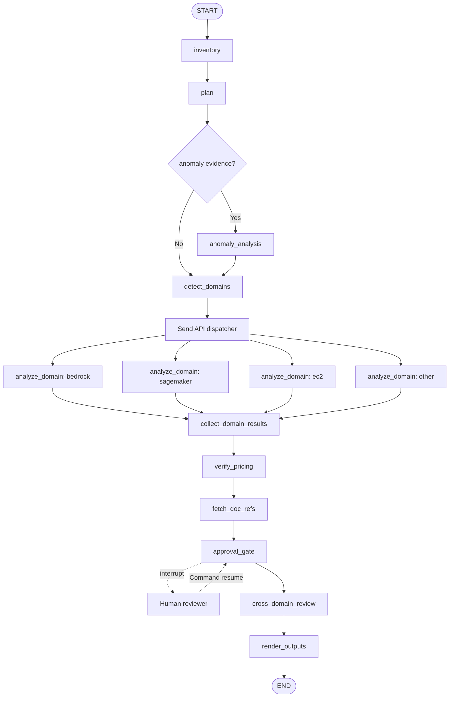
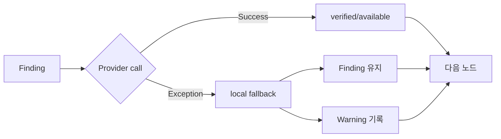
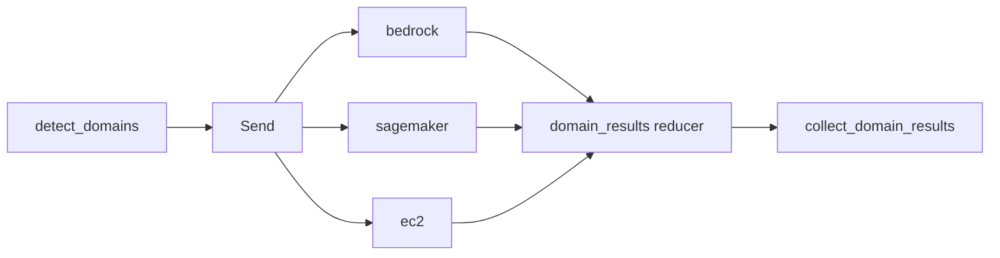
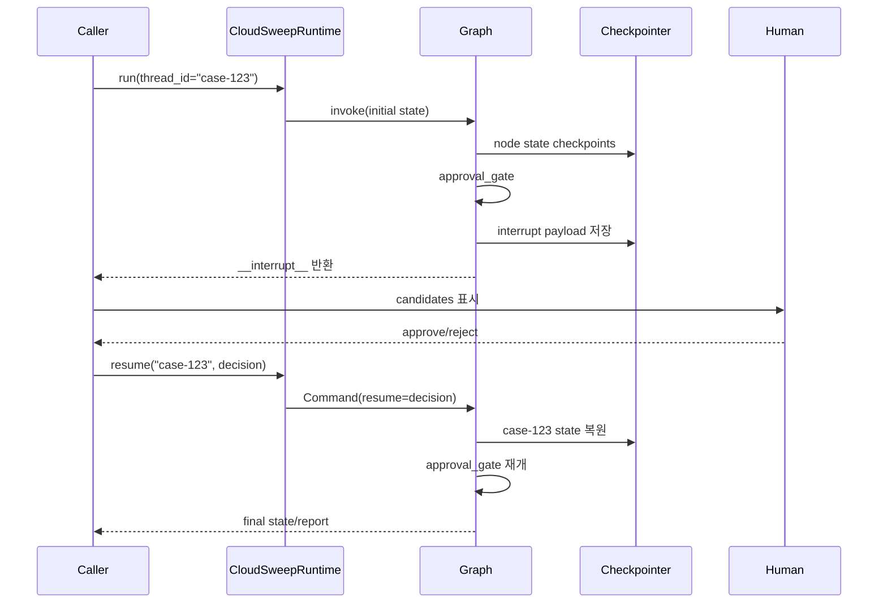
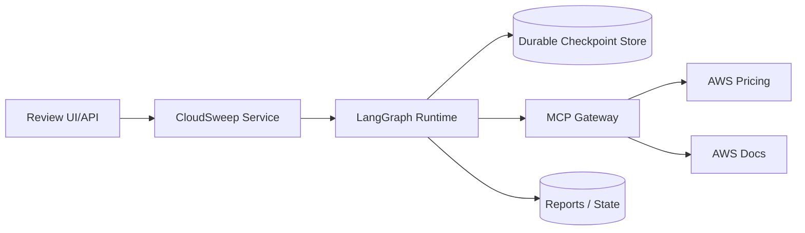

# CloudSweep Runtime Architecture

이 문서는 CloudSweep의 Level 5 runtime 구조를 설명한다.

대상 기능은 다음 세 가지다.

```text
6. MCP enrichment
7. Send API fan-out
8. checkpoint + interrupt
```

핵심 원칙은 다음과 같다.

> 비용 문제 탐지는 로컬 evidence와 deterministic rule로 수행하고, 외부 MCP와 사람 승인은 탐지 뒤에 배치한다.

---

## 1. 전체 실행 흐름



노드 순서를 이렇게 둔 이유는 간단하다.

1. AWS Pricing이나 문서 서비스가 실패해도 finding은 만들어져야 한다.
2. 사람은 원본 evidence뿐 아니라 가격·문서가 보강된 finding을 보고 승인해야 한다.
3. 여러 domain은 서로 독립적으로 분석한 뒤 마지막에 cross-domain 관점으로 합친다.

---

## 2. 노드 책임

| 노드 | 책임 | 외부 실패 영향 |
|------|------|----------------|
| `inventory` | evidence 파일 목록 수집 | 없음 |
| `plan` | anomaly/domain/report 실행 계획 결정 | 없음 |
| `detect_domains` | Terraform과 JSON evidence에서 domain 탐지 | 없음 |
| `analyze_domain` | 한 domain의 deterministic rule 실행 | 해당 branch만 영향 |
| `collect_domain_results` | 병렬 결과 정렬·병합 | 없음 |
| `verify_pricing` | 가격 출처와 검증 결과 추가 | fallback 사용 |
| `fetch_doc_refs` | AWS 공식 문서 URL 추가 | unavailable 기록 |
| `approval_gate` | 고비용·낮은 confidence finding 승인 요청 | checkpoint에서 대기 |
| `cross_domain_review` | 서비스 간 위험과 중복 검토 | 없음 |
| `render_outputs` | report, Terraform, state 생성 | 파일 쓰기 실패만 영향 |

---

## 3. MCP Enrichment Architecture

### 3-1. 왜 provider로 분리했나

Python으로 실행되는 CloudSweep는 대화 환경의 MCP tool을 직접 호출할 수 있다고 가정하면 안 된다.

MCP transport는 실행 환경에 따라 달라질 수 있다.

```text
Claude/Codex connector
로컬 MCP process
HTTP MCP gateway
테스트 fake provider
MCP 없는 CLI
```

그래프가 특정 transport를 직접 알면 실행 환경을 바꿀 때 그래프까지 수정해야 한다.

그래서 다음 인터페이스만 사용한다.

```python
class EnrichmentProvider(Protocol):
    name: str

    def verify_pricing(self, finding): ...
    def fetch_doc_refs(self, finding): ...
```

구현 파일:

```text
cloudsweep/enrichment.py
```

### 3-2. 기본 fallback provider

일반 CLI 실행은 `FallbackEnrichmentProvider`를 사용한다.

```text
scenario/genai evidence 가격 있음
  → status=evidence_only

가격 근거 없음
  → status=unavailable

AWS docs MCP 없음
  → documentation.status=unavailable
```

중요한 점은 fallback이 finding을 삭제하지 않는다는 것이다.

```text
deterministic finding
  + pricing_verification 상태
  + documentation 상태
```

### 3-3. Callable MCP adapter

실제 MCP gateway를 연결할 때는 두 함수를 주입한다.

```python
from cloudsweep.enrichment import CallableMCPEnrichmentProvider

provider = CallableMCPEnrichmentProvider(
    pricing_lookup=pricing_gateway.lookup,
    docs_search=docs_gateway.search,
)
```

그래프는 adapter 내부의 HTTP, stdio, SDK 구현을 알 필요가 없다.

가격 검증 결과 예시:

```json
{
  "status": "verified",
  "source": "aws-pricing-mcp",
  "service_code": "AmazonSageMaker",
  "verified_unit_price_usd": 1.23
}
```

문서 보강 결과 예시:

```json
{
  "status": "available",
  "source": "aws-docs-mcp",
  "urls": [
    "https://docs.aws.amazon.com/..."
  ]
}
```

### 3-4. MCP 실패 흐름



provider가 finding 하나에서 예외를 발생시켜도 나머지 finding을 계속 처리한다.

보고서와 state에는 provider 이름, finding 수, failure 수가 기록된다.

---

## 4. Send API Fan-Out

### 4-1. 이전 구조

이전에는 한 노드가 모든 analyzer를 순서대로 실행했다.

```text
analyze_domains
  → lambda
  → s3
  → dynamodb
  → bedrock
  → sagemaker
  → ec2
```

domain이 늘어날수록 한 노드가 커지고, 느린 analyzer가 전체를 기다리게 했다.

### 4-2. 변경된 구조

`detect_domains` 결과를 LangGraph `Send` 객체로 변환한다.

```python
[
    Send("analyze_domain", {"analysis_domain": "bedrock", ...}),
    Send("analyze_domain", {"analysis_domain": "sagemaker", ...}),
    Send("analyze_domain", {"analysis_domain": "ec2", ...}),
]
```

각 branch는 같은 `analyze_domain` 노드를 사용하지만 서로 다른 domain state를 받는다.



### 4-3. Reducer

병렬 branch가 같은 state key에 결과를 추가할 수 있도록 reducer를 선언했다.

```python
domain_results: Annotated[list[dict], operator.add]
```

각 branch는 다음처럼 자기 결과 한 개만 반환한다.

```json
{
  "domain_results": [
    {
      "domain": "bedrock",
      "findings": [],
      "warnings": []
    }
  ]
}
```

### 4-4. 결정적 결과 순서

병렬 실행 완료 순서는 매번 달라질 수 있다.

보고서 결과가 실행마다 바뀌지 않도록 `collect_domain_results`에서 원래 domain 순서로 다시 정렬한다.

```text
detected domains: bedrock, sagemaker, ec2

최종 결과 순서:
  bedrock findings
  sagemaker findings
  ec2 findings
```

이 덕분에 테스트와 report diff가 안정적이다.

---

## 5. Checkpoint and Interrupt

### 5-1. Runtime 객체

일반 `run_graph()`는 승인 없이 한 번에 실행한다.

승인과 재개가 필요한 실행은 `CloudSweepRuntime`을 사용한다.

```python
from cloudsweep.graph import CloudSweepRuntime

runtime = CloudSweepRuntime()
```

기본 checkpointer는 LangGraph `InMemorySaver`다.

```text
같은 Python process 안에서 interrupt/resume 가능
process 종료 후에는 checkpoint가 사라짐
```

각 신규 실행은 고유한 `thread_id`를 사용해야 한다. 이미 존재하는 thread로 다시 `run()`하면 이전 reducer 결과가 섞이지 않도록 오류를 발생시키며, 중단된 실행은 반드시 `resume()`으로 이어간다.

운영 환경에서는 생성자에 durable checkpointer를 주입해야 한다.

```python
runtime = CloudSweepRuntime(checkpointer=durable_checkpointer)
```

그래프는 checkpointer 종류를 알 필요가 없다.

### 5-2. 승인 대상

다음 finding을 사람 승인 대상으로 선택한다.

```text
estimated_monthly_saving_usd >= approval_threshold_usd
또는
confidence == LOW
```

기본 금액 기준은 월 500달러다.

낮은 confidence finding은 금액이 0이어도 architecture 변경을 제안할 수 있어 승인 대상에 포함한다.

### 5-3. Interrupt 흐름



### 5-4. 실행 예시

```python
paused = runtime.run(
    "sample/season2/GENAI-001",
    thread_id="genai-review-001",
    write=False,
    require_approval=True,
    approval_threshold_usd=500,
)

request = paused["__interrupt__"][0].value
print(request["candidates"])
```

승인:

```python
finished = runtime.resume(
    "genai-review-001",
    {
        "approved": True,
        "reviewer": "finops-owner"
    },
)
```

거부:

```python
finished = runtime.resume(
    "genai-review-001",
    {
        "approved": False,
        "reviewer": "service-owner",
        "reason": "latency test required"
    },
)
```

거부해도 finding은 사라지지 않는다.

```text
approval_status=rejected
findings remain advisory only
```

현재 CloudSweep는 remediation을 AWS에 자동 적용하지 않는다. 승인은 최종 보고와 remediation 계획을 검토했다는 의미다.

---

## 6. State Contract

새로 추가한 주요 state 값은 다음과 같다.

| State | 의미 |
|-------|------|
| `analysis_domain` | Send branch가 분석할 domain |
| `domain_results` | reducer가 합치는 branch 결과 |
| `enrichment_status` | pricing/docs provider와 실패 수 |
| `require_approval` | 승인 게이트 사용 여부 |
| `approval_threshold_usd` | 고비용 승인 기준 |
| `approval_status` | pending, approved, rejected, not_required |
| `approval_decision` | reviewer가 전달한 승인 정보 |

최종 state JSON에도 enrichment와 approval 결과를 저장한다.

---

## 7. 실행 모드

### 로컬 CLI

```text
FallbackEnrichmentProvider
Send fan-out
승인 없음
checkpointer 없음
한 번에 report 생성
```

```powershell
python -m cloudsweep sample\season2\GENAI-001 --dry-run
```

### 애플리케이션 또는 API 서버

```text
CallableMCPEnrichmentProvider
Send fan-out
CloudSweepRuntime
durable checkpointer
UI/API에서 interrupt 승인
```

추천 배포 경계:



---

## 8. 실패 정책

| 실패 | 처리 |
|------|------|
| Domain analyzer 미구현 | warning 후 다른 domain 계속 |
| Pricing provider 예외 | 해당 finding만 local fallback |
| Docs provider 예외 | URL unavailable, finding 유지 |
| 승인 대기 | checkpoint 후 caller에 interrupt 반환 |
| 승인 거부 | advisory report 생성, 거부 상태 기록 |
| 리소스 evidence 부족 | finding 미생성 또는 LOW confidence |

외부 서비스 장애가 core detection을 막지 않는 것이 가장 중요한 규칙이다.

---

## 9. 현재 구현과 운영 전 남은 연결

완료된 구조:

```text
MCP provider interface
local fallback
callable MCP adapter
pricing/docs enrichment nodes
Send fan-out + reducer + deterministic collect
InMemory checkpoint
interrupt + Command resume
approval status report/state 저장
```

운영 배포 전에 필요한 항목:

```text
실제 AWS Pricing MCP gateway 함수 연결
실제 AWS Docs MCP gateway 함수 연결
SQLite/Postgres 등 durable checkpointer 선택
승인 UI 또는 API endpoint
인증과 reviewer 권한 검사
MCP timeout/retry/circuit breaker 정책
checkpoint 보존 기간과 암호화 정책
```

즉, 그래프 아키텍처와 교체 지점은 구현됐고 실제 MCP transport와 운영 저장소는 배포 환경에서 연결하면 된다.
