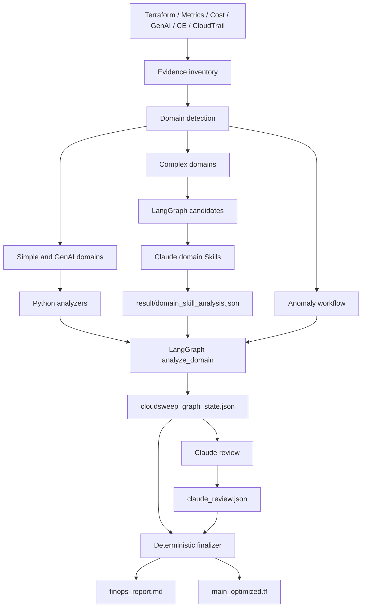

# CloudSweep

CloudSweep는 AWS 비용 낭비와 비용 이상 징후를 분석하는 LangGraph 기반 FinOps 도구다.

Terraform, CloudWatch 지표, 비용 보고서, Cost Explorer, CloudTrail, GenAI 사용량을 함께 읽어 다음 결과를 만든다.

- 서비스별 비용 최적화 finding
- 재현 가능한 절감액과 evidence fact
- 서비스 간 의존성과 요청 증폭 관계
- 검토용 Terraform 변경 후보
- Claude 검토가 반영된 최종 보고서

CloudSweep는 AWS 리소스나 Terraform을 직접 적용하지 않는다.

## 빠른 시작

```powershell
pip install -r requirements.txt

# 결과 파일을 만들지 않고 분석
python -m cloudsweep sample\season2\MA-001 --dry-run

# result/ 아래에 machine analysis 생성
python -m cloudsweep sample\season2\MA-001

# 전체 회귀 테스트
python -m unittest discover -s tests -v
```

현재 확인된 샘플 결과:

```text
MA-001     lambda, s3, dynamodb       6 findings
GENAI-001  bedrock, sagemaker, ec2    7 findings
Test suite                              29 tests OK
```

## 실행 구조

CloudSweep는 규칙의 성격에 따라 분석 책임을 나눈다.

| 유형 | 도메인 | 최초 분석 주체 |
|------|--------|----------------|
| 단순 정책·관계형 | lambda, s3, dynamodb, cloudwatch, cloudwatch-alarm, sqs, kinesis, ebs, nat, tgw, organizations | Python analyzer |
| GenAI | bedrock, sagemaker, ec2 | Python rich analyzer |
| 복잡 판단형 | rds, elb, ecs, elasticache | Python 후보 + Claude domain Skill 판단 |
| 비용 이상 | Cost Explorer, anomaly, CloudTrail | LangGraph anomaly workflow |

단순·GenAI 도메인은 Python이 탐지, threshold, 계산을 담당하고 Claude는 결과를 검토한다.

복잡 도메인은 LangGraph가 규칙 후보와 계산을 먼저 만들고 Claude Skill이 여러
지표, 의존성, SLA 예외를 검토해 `accepted`, `rejected`, `needs_evidence`를
결정한다. LangGraph는 Skill이 수치나 Terraform을 덮어쓰지 못하게 한다.



## `/finops` 사용

Claude Code에서는 `/finops`를 기본 진입점으로 사용한다.

```text
/finops
```

오케스트레이터는 다음 순서로 동작한다.

1. `WORK_DIR`의 evidence와 도메인을 확인한다.
2. LangGraph를 한 번 실행해 `result/{domain}_skill_request.json`을 만든다.
3. `rds`, `elb`, `ecs`, `elasticache` request가 있으면 해당 Skill을 실행한다.
4. Skill은 판단만 담은 `result/{domain}_skill_analysis.json`을 작성한다.
5. `python -m cloudsweep <WORK_DIR>`로 LangGraph를 다시 실행한다.
6. `cloudsweep_graph_state.json`의 모든 finding을 검토한다.
7. `result/claude_review.json`을 작성한다.
8. deterministic finalizer를 실행한다.

복잡 도메인의 Skill 출력 파일:

| 도메인 | Skill | 출력 |
|--------|-------|------|
| RDS | `finops-rds` | `result/rds_skill_analysis.json` |
| ELB | `finops-elb` | `result/elb_skill_analysis.json` |
| ECS | `finops-ecs` | `result/ecs_skill_analysis.json` |
| ElastiCache | `finops-elasticache` | `result/elasticache_skill_analysis.json` |

CLI만 실행해 Skill 파일이 없으면 해당 복잡 도메인의 Python 규칙은
`needs_skill_review` 후보만 만든다. 이 후보는 절감액 합산과 Terraform 변경에서
제외되며 `result/{domain}_skill_request.json`에 기록된다. Skill이
`result/{domain}_skill_analysis.json`을 작성한 뒤 LangGraph를 다시 실행해야 한다.

MiniStack 입력을 Skill보다 먼저 준비할 때는 수집 전용 옵션을 사용한다.

```powershell
python -m cloudsweep <WORK_DIR> --from-ministack --collect-only
```

## 분석과 최종화

### 1. Machine analysis

```powershell
python -m cloudsweep <WORK_DIR>
```

기본 산출물:

```text
<WORK_DIR>/result/
  cloudsweep_graph_state.json
  cloudsweep_graph_report.md
  cloudsweep_main_optimized.tf
```

`--dry-run`은 파일을 쓰지 않는다. `--standard-output`은 graph report와 Terraform 후보를 각각 `finops_report.md`, `main_optimized.tf` 이름으로 쓴다.

### 2. Claude review

Claude는 stable `finding_id`마다 다음 중 하나를 기록한다.

- `accepted`
- `rejected`
- `needs_evidence`

Review는 설명, review confidence, 문서 링크를 추가할 수 있지만 machine analysis에 들어간 절감액은 수정할 수 없다. 관측된 cross-domain 설명은 반드시 `fact_id`를 인용해야 한다.

계약 파일은 `schemas/claude-review.schema.json`이다.

### 3. Deterministic finalize

```powershell
python -m cloudsweep finalize <WORK_DIR> --review <WORK_DIR>\result\claude_review.json
```

최종 산출물:

```text
<WORK_DIR>/result/
  finops_report.md
  main_optimized.tf
```

Finalizer는 다음 규칙을 강제한다.

- 모든 finding이 review에 포함되어야 한다.
- `accepted` finding만 절감액에 합산한다.
- alternative 또는 cascade saving은 중복 합산하지 않는다.
- Terraform source hash가 분석 시점과 다르면 patch를 거부한다.
- Terraform은 자동 적용하지 않는다.

## 입력 Evidence

분석 질문에 필요한 파일만 제공하면 된다.

| Evidence | 기본 경로 | 용도 |
|----------|-----------|------|
| Terraform | `main.tf` | 리소스, 설정, 참조 관계, 변경 후보 |
| Metrics | `metrics.json`, `metrics/metrics.json` | 평균, p95/p99, 오류, throttling, lag |
| Cost report | `cost_report.json` | 서비스·리소스 비용과 가격 근거 |
| Parsed input | `parsed_input.json` | 기존 수집기의 구조화 evidence |
| GenAI usage | `genai_evidence.json` | token, cache, endpoint, accelerator 비용 |
| Cost Explorer | `mock_responses/get_cost_and_usage*.json` | 비용 spike와 서비스 attribution |
| Cost anomaly | `mock_responses/get_anomalies.json` | 이상 비용 확인과 영향 범위 |
| CloudTrail | `mock_responses/cloudtrail*.json`, `cloudtrail.json` | triggering event 시간 상관관계 |
| Complex Skill output | `result/{domain}_skill_analysis.json` | 복잡 도메인의 선행 분석 결과 |

필수 evidence가 부족하면 억지로 finding을 확정하지 않고 confidence를 낮추거나 evidence gap을 남긴다.

## Rule Engine과 Fact Graph

18개 도메인은 공통 `AnalyzerRegistry`에 등록된다. 서비스마다 별도 LangGraph 노드를 만들지 않고 `analyze_domain` 노드가 Registry에서 구현을 선택한다.

Rule v2 계약은 `schemas/finops-rule-v2.schema.json`에 정의되어 있다.

```text
facts       판정에 사용하는 구조화 evidence
predicate   all / any / not과 비교 연산
thresholds  판정 경계값
outcome     severity, action, confidence
handlers    extractor, savings, remediation 구현 이름
```

Rule 파일은 시작 시 로드되며 알 수 없는 fact, operator, threshold, handler를 거부한다. 현재 Registry에는 18개 도메인과 20개 Rule JSON 파일이 연결되어 있다.

Graph state에는 다음 추적 정보가 포함된다.

- stable `run_id`, `finding_id`, `fact_id`
- analyzer와 rule version
- finding별 `evidence_facts`
- Terraform reference dependency
- request/invocation ratio
- retry amplification ratio
- cache hit rate
- anomaly spike, service attribution, triggering-event confidence

## MCP와 승인 흐름

기본 CLI는 로컬 enrichment fallback을 사용하며 승인 단계에서 멈추지 않는다.

애플리케이션에서는 `CallableMCPEnrichmentProvider`와 `CloudSweepRuntime`을 사용할 수 있다.

- AWS Pricing 및 문서 MCP adapter 주입
- LangGraph `Send` 기반 domain fan-out
- checkpointer 기반 interrupt/resume
- 고비용 또는 낮은 confidence finding의 사람 승인

기본 checkpointer는 `InMemorySaver`다. 운영 환경에서는 durable checkpointer와 실제 MCP transport를 별도 adapter로 연결해야 한다.

## 저장소 구조

```text
.claude/skills/
  finops/                       # /finops 오케스트레이터
  finops-*/SKILL.md             # 도메인 검토 또는 복잡 도메인 분석 계약
  finops-*/rules/*.json         # Rule v2 정책 파일

cloudsweep/
  graph.py                      # LangGraph state, nodes, analyzers, CLI
  rule_engine.py                # Predicate, RuleEngine, AnalyzerRegistry
  enrichment.py                 # Pricing/docs provider와 fallback
  finalizer.py                  # Review 검증과 최종 renderer
  __main__.py                   # python -m cloudsweep

schemas/
  finops-rule-v2.schema.json    # Rule v2 계약
  genai-evidence.schema.json    # Terraform 없는 GenAI evidence 계약
  skill-analysis.schema.json    # 복잡 도메인 Skill 출력 계약
  claude-review.schema.json     # Claude review 계약

sample/
  season1/                      # 단일 서비스 회귀 fixture
  season2/
    LV-001/                     # Cost anomaly workflow
    MA-001/                     # Lambda + S3 + DynamoDB
    GENAI-001/                  # Bedrock + SageMaker + EC2
    XS-001/                     # 작은 multi-domain fixture

tests/
  test_all_domains.py
  test_finalizer.py
  test_genai_analyzers.py
  test_graph_architecture.py
  test_graph_smoke.py
  test_rule_engine.py
```

## 테스트

```powershell
python -m unittest discover -s tests -v
```

회귀 테스트는 다음을 확인한다.

- 18개 도메인 Registry coverage
- Season 1 fixture 분석
- 복잡 도메인 Skill output 로딩과 Python fallback
- 단순·GenAI Skill의 review-only 경계
- Rule v2 predicate와 handler 검증
- GenAI analyzer finding과 절감액
- Send fan-out, MCP fallback, checkpoint interrupt/resume
- anomaly workflow와 cross-service dependency fact
- Claude review run ID 및 Terraform source hash 검증

## 문서

- `ARCHITECTURE.md`: LangGraph runtime과 배포 adapter 구조
- `0622.md`: 구현 과정과 하이브리드 구조 설명
- `FINAL_REPORT.md`: 프로젝트 결과 정리

## License

MIT License
