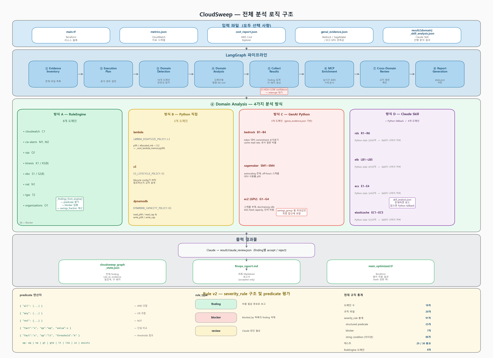
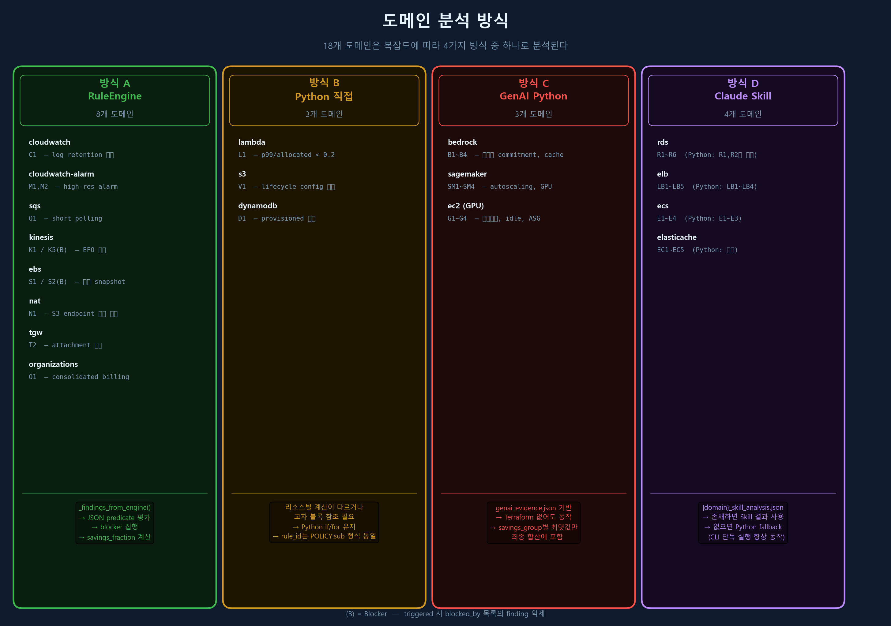
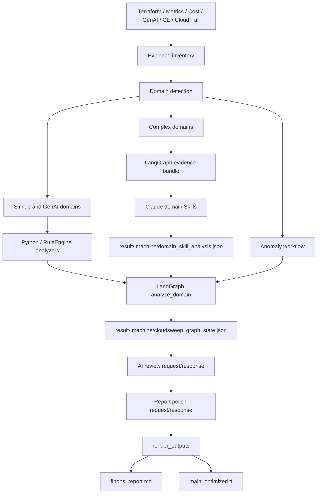
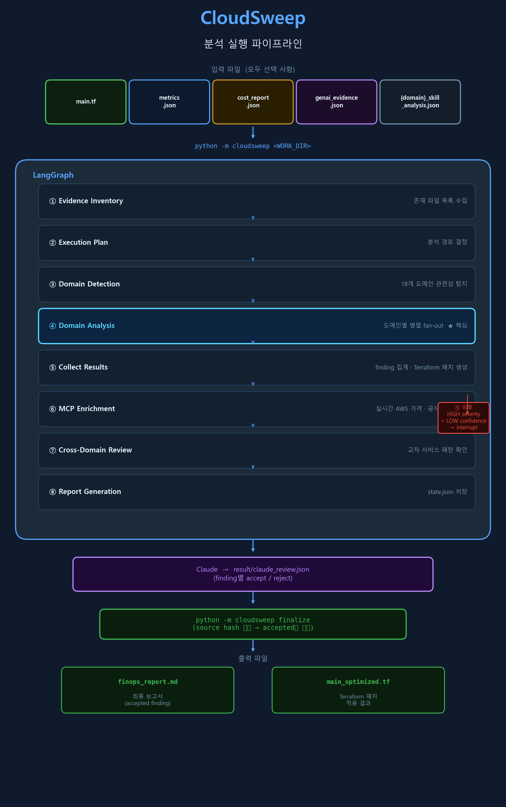
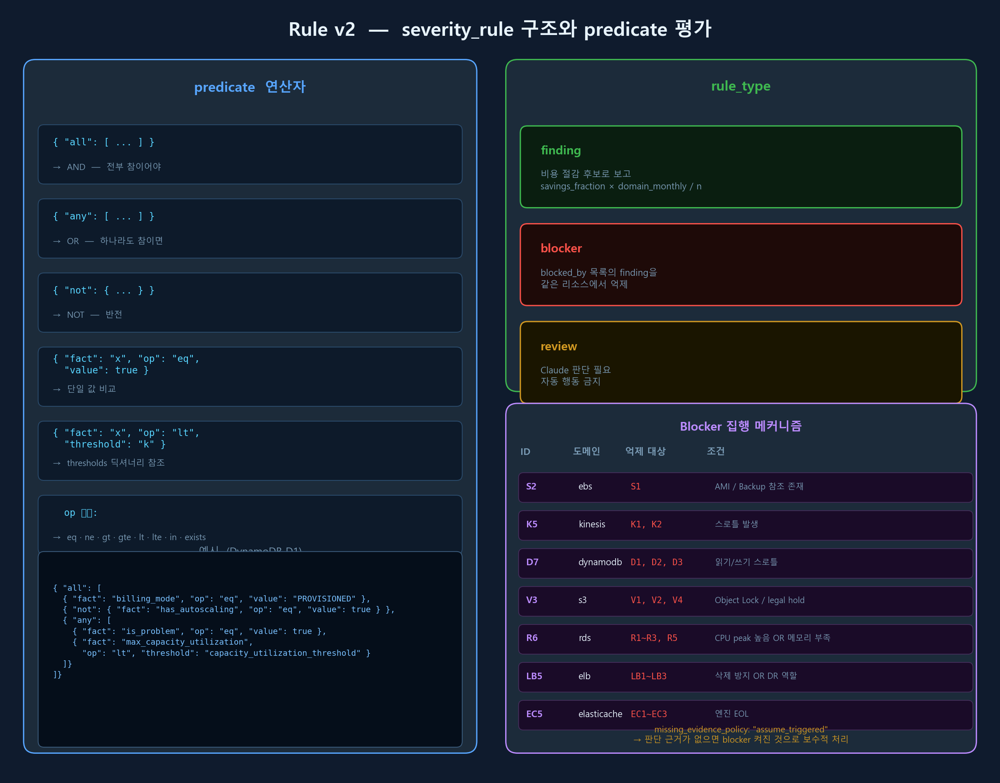

# CloudSweep

CloudSweep는 AWS 비용 낭비와 비용 이상 징후를 분석하는 LangGraph 기반 FinOps 도구다.

Terraform, CloudWatch 지표, 비용 보고서, Cost Explorer, CloudTrail, GenAI 사용량을 함께 읽어 다음 결과를 만든다.

- 서비스별 비용 최적화 finding
- 재현 가능한 절감액과 evidence fact
- 서비스 간 의존성과 요청 증폭 관계
- 검토용 Terraform 변경 후보
- Claude 검토가 반영된 최종 보고서

CloudSweep는 AWS 리소스나 Terraform을 직접 적용하지 않는다.

## 전체 구조 한눈에 보기



입력 evidence부터 `finops_report.md` / `main_optimized.tf` 산출까지 한 장으로 정리한 그림이다. 아래 각 섹션에서 파이프라인, 도메인 분석 방식, Rule v2 구조를 더 자세히 다룬다.

## 빠른 시작

```powershell
pip install -r requirements.txt

# 결과 파일을 만들지 않고 분석
python -m cloudsweep sample\season2\MA-001 --dry-run

# result/ 아래에 machine analysis 생성
python -m cloudsweep sample\season2\MA-001

# 전체 회귀 테스트
python -m unittest discover -s tests -v
```

현재 확인된 샘플 결과:

```text
MA-001     lambda, s3, dynamodb       6 findings
GENAI-001  bedrock, sagemaker, ec2    7 findings
Test suite                              73 tests OK
```

## 실행 구조

CloudSweep는 규칙의 성격에 따라 분석 책임을 나눈다.

| 유형 | 도메인 | 최초 분석 주체 |
|------|--------|----------------|
| 단순 정책 (RuleEngine) | cloudwatch, cloudwatch-alarm, sqs, kinesis, ebs, nat, tgw, organizations | Rule v2 JSON + `RuleEngine` |
| 단순 정책 (Python 직접) | lambda, s3, dynamodb | Python analyzer (교차 블록 참조 필요) |
| GenAI | bedrock, sagemaker, ec2 | Python rich analyzer (`genai_evidence.json` 기반) |
| 복잡 판단형 | rds, elb, ecs, elasticache | Python 후보 + Claude domain Skill 판단 |
| 비용 이상 | Cost Explorer, anomaly, CloudTrail | LangGraph anomaly workflow |

단순·GenAI 도메인은 Python(또는 선언적 Rule v2 JSON)이 탐지, threshold, 계산을 담당하고 Claude는 결과를 검토한다.

복잡 도메인은 LangGraph가 evidence 번들을 먼저 만들고 Claude Skill이 여러
지표, 의존성, SLA 예외를 검토해 finding 자체(절감액 포함)를 작성한다. 가격을
`cost_report.json`에서 구할 수 없을 때는 LangGraph가 `pricing_cache/{domain}_pricing_model.json`
공용 캐시를 채우도록 요청하고, Claude는 단위 가격만 채운다. 수량 x 단가
계산은 항상 LangGraph 또는 Skill 자신이 수행한다.

18개 도메인이 4가지 방식 중 무엇으로 분석되는지는 아래 그림에 정리했다.




```mermaid
flowchart TD
    INPUT[Terraform / Metrics / Cost / GenAI / CE / CloudTrail] --> INV[Evidence inventory]
    INV --> DET[Domain detection]

    DET --> SIMPLE[Simple and GenAI domains]
    DET --> COMPLEX[Complex domains]
    DET --> ANOM[Anomaly workflow]

    SIMPLE --> PY[Python / RuleEngine analyzers]
    COMPLEX --> BUNDLE[LangGraph evidence bundle]
    BUNDLE --> SKILL[Claude domain Skills]
    SKILL --> SKILLJSON[result/.machine/domain_skill_analysis.json]

    PY --> GRAPH[LangGraph analyze_domain]
    SKILLJSON --> GRAPH
    ANOM --> GRAPH

    GRAPH --> STATE[result/.machine/cloudsweep_graph_state.json]
    STATE --> AIREV[AI review request/response]
    AIREV --> POLISH[Report polish request/response]
    POLISH --> RENDER[render_outputs]
    RENDER --> REPORT[finops_report.md]
    RENDER --> TF[main_optimized.tf]
```

같은 흐름을 파일 경로와 함께 정리한 그림:



## `/finops` 사용

Claude Code에서는 `/finops`를 기본 진입점으로 사용한다.

```text
/finops
```

오케스트레이터는 다음 순서로 동작하며, machine 전용 파일은 모두
`result/.machine/` 아래에 쓰인다.

1. `WORK_DIR`의 evidence와 도메인을 확인한다. MiniStack evidence라면 먼저 수집한다.
2. LangGraph를 한 번 실행한다. 복잡 도메인마다 `result/.machine/{domain}_skill_request.json`을 만든다.
3. `cost_report.json`이 없어 가격을 못 구한 도메인은 `result/.machine/{domain}_pricing_request.json`을 만든다. Claude가 AWS Pricing MCP로 단위 가격을 조회해 공용 캐시 `pricing_cache/{domain}_pricing_model.json`에 병합한다 (건너뛰어도 static fallback 가격으로 finding은 계속 생성된다).
4. `rds`, `elb`, `ecs`, `elasticache` request가 있으면 해당 Skill을 실행해 `result/.machine/{domain}_skill_analysis.json`을 작성한다.
5. `python -m cloudsweep <WORK_DIR>`로 LangGraph를 다시 실행한다. Skill 결과를 읽어 `finding_id`, `savings_group`, `evidence_facts`로 보강한다.
6. `result/.machine/cloudsweep_graph_state.json`의 `analyzer_coverage`가 `unsupported`면 오류로 처리한다.
7. `result/.machine/ai_review_request.json`이 있으면 AI review를 수행해 `result/.machine/ai_review.json`을 작성한다 (`schemas/ai-review.schema.json`). finding ID·절감액·가격 출처·Terraform patch는 수정할 수 없는 advisory 검토다.
8. LangGraph를 다시 실행한다. `result/.machine/report_polish_request.json`이 있으면 실행 요약 prose를 `result/.machine/report_polish.json`으로 작성한다 (`schemas/report-polish.schema.json`).
9. LangGraph를 마지막으로 실행하면 AI review와 report polish가 반영된 `result/finops_report.md`, `result/main_optimized.tf`가 나온다.

복잡 도메인의 Skill 출력 파일:

| 도메인 | Skill | 출력 |
|--------|-------|------|
| RDS | `finops-rds` | `result/.machine/rds_skill_analysis.json` |
| ELB | `finops-elb` | `result/.machine/elb_skill_analysis.json` |
| ECS | `finops-ecs` | `result/.machine/ecs_skill_analysis.json` |
| ElastiCache | `finops-elasticache` | `result/.machine/elasticache_skill_analysis.json` |

CLI만 실행해 Skill 파일이 없으면 해당 복잡 도메인은 finding을 만들지 않고
`result/.machine/{domain}_skill_request.json`만 기록한다. Skill이
`result/.machine/{domain}_skill_analysis.json`을 작성한 뒤 LangGraph를 다시
실행해야 한다. request 번들만 보고 절감액을 추정해서는 안 된다.

MiniStack 입력을 Skill보다 먼저 준비할 때는 수집 전용 옵션을 사용한다.

```powershell
python -m cloudsweep <WORK_DIR> --from-ministack --collect-only
```

## 분석과 최종화

### 1. LangGraph 실행 (여러 번 재실행)

```powershell
python -m cloudsweep <WORK_DIR>
```

같은 명령을 `/finops` 흐름의 각 단계마다(Skill 실행 후, pricing 캐시 갱신 후, AI review 작성 후, report polish 작성 후) 다시 실행한다. 상태는 매번 아래 위치에 쓰인다.

```text
<WORK_DIR>/result/
  cloudsweep_graph_report.md          # --standard-output 없이 실행할 때 이름
  cloudsweep_main_optimized.tf
  .machine/
    cloudsweep_graph_state.json       # 전체 finding, rule_id, evidence_facts
    {domain}_skill_request.json       # 복잡 도메인 evidence 번들 (Skill 대기 중)
    {domain}_pricing_request.json     # 공용 가격 조회 요청 (cost_report 없을 때)
    ai_review_request.json / ai_review.json
    report_polish_request.json / report_polish.json
```

`--dry-run`은 파일을 쓰지 않는다. `--standard-output`은 최종 리포트와 Terraform 후보 이름을 `finops_report.md`, `main_optimized.tf`로 고정한다 (`/finops` 완료 시 사용하는 이름).

### 2. Legacy finalize (독립 실행 경로)

과거 `claude_review.json` accept/reject 계약은 여전히 지원되지만, 위
AI review + report polish 흐름과는 분리된 별도 경로다. `/finops`를 쓸 때는
이 경로를 실행하지 않는다. `--review`는 `schemas/claude-review.schema.json`을
따르는, 직접 작성한 review 파일 경로를 가리킨다.

```powershell
python -m cloudsweep finalize <WORK_DIR> --review <path-to-review.json>
```

계약 파일은 `schemas/claude-review.schema.json`이며, `accepted`/`rejected`/`needs_evidence`
review로 `finding_id`별 절감액 합산 여부를 결정한다. 출력은
`result/.machine/` 아래에 격리되어 기본 `finops_report.md`를 덮어쓰지 않는다.
Finalizer는 모든 finding이 review에 포함되어야 하고, Terraform source hash가
분석 시점과 다르면 patch를 거부하며, alternative/cascade saving을 중복 합산하지
않는다. 두 경로 모두 Terraform은 자동 적용하지 않는다.

### 3. Token & Cost Usage

최종 `finops_report.md`에는 `## Token & Cost Usage` 섹션이 함께 생성된다.
`cloudsweep/token_usage.py`가 이번 실행 구간(Skill 분석 → pricing 조회 →
AI review → report polish) 동안 로컬 Claude Code 세션 transcript에서
assistant turn usage를 합산해 입력/출력/캐시 토큰과 예상 비용(Sonnet 5 표준
가격 기준)을 기록한다. LangGraph 자체는 LLM을 호출하지 않으므로 이 값은
같은 완료 구간에서 Claude가 수행한 작업량의 근사치이며, subagent 세션
사용량은 포함되지 않는다.

## 입력 Evidence

분석 질문에 필요한 파일만 제공하면 된다.

| Evidence | 기본 경로 | 용도 |
|----------|-----------|------|
| Terraform | `main.tf` | 리소스, 설정, 참조 관계, 변경 후보 |
| Metrics | `metrics.json`, `metrics/metrics.json` | 평균, p95/p99, 오류, throttling, lag |
| Cost report | `cost_report.json` | 서비스·리소스 비용과 가격 근거 |
| Parsed input | `parsed_input.json` | 기존 수집기의 구조화 evidence |
| GenAI usage | `genai_evidence.json` | token, cache, endpoint, accelerator 비용 |
| Cost Explorer | `mock_responses/get_cost_and_usage*.json` | 비용 spike와 서비스 attribution |
| Cost anomaly | `mock_responses/get_anomalies.json` | 이상 비용 확인과 영향 범위 |
| CloudTrail | `mock_responses/cloudtrail*.json`, `cloudtrail.json` | triggering event 시간 상관관계 |
| Complex Skill output | `result/.machine/{domain}_skill_analysis.json` | 복잡 도메인의 선행 분석 결과 |

필수 evidence가 부족하면 억지로 finding을 확정하지 않고 confidence를 낮추거나 evidence gap을 남긴다.

## Rule Engine과 Fact Graph

18개 도메인은 공통 `AnalyzerRegistry`에 등록된다. 서비스마다 별도 LangGraph 노드를 만들지 않고 `analyze_domain` 노드가 Registry에서 구현을 선택한다.

Rule v2 계약은 `schemas/finops-rule-v2.schema.json`에 정의되어 있다.

```text
facts       판정에 사용하는 구조화 evidence
predicate   all / any / not과 비교 연산
thresholds  판정 경계값
outcome     severity, action, confidence
handlers    extractor, savings, remediation 구현 이름
```

Rule 파일은 시작 시 로드되며 알 수 없는 fact, operator, threshold, handler를 거부한다. 현재 Registry에는 18개 도메인과 20개 Rule JSON 파일, 91개 `severity_rule`(finding 73 / blocker 7 / review 11)이 연결되어 있다. 전체 분류표는 `RULE_CATALOG.md`에 있다.



Graph state에는 다음 추적 정보가 포함된다.

- stable `run_id`, `finding_id`, `fact_id`
- analyzer와 rule version
- finding별 `evidence_facts`
- Terraform reference dependency
- request/invocation ratio
- retry amplification ratio
- cache hit rate
- anomaly spike, service attribution, triggering-event confidence

## MCP와 승인 흐름

기본 CLI는 로컬 enrichment fallback을 사용하며 승인 단계에서 멈추지 않는다.

애플리케이션에서는 `CallableMCPEnrichmentProvider`와 `CloudSweepRuntime`을 사용할 수 있다.

- AWS Pricing 및 문서 MCP adapter 주입
- LangGraph `Send` 기반 domain fan-out
- checkpointer 기반 interrupt/resume
- 고비용 또는 낮은 confidence finding의 사람 승인

기본 checkpointer는 `InMemorySaver`다. 운영 환경에서는 durable checkpointer와 실제 MCP transport를 별도 adapter로 연결해야 한다.

## 저장소 구조

```text
.claude/skills/
  finops/                       # /finops 오케스트레이터
  finops-*/SKILL.md             # 도메인 검토 또는 복잡 도메인 분석 계약
  finops-*/rules/*.json         # Rule v2 정책 파일

cloudsweep/
  graph.py                      # LangGraph state, node wiring, CLI (main), Send fan-out, 승인 게이트
  domain_analyzers.py           # 18개 도메인 analyzer 구현과 AnalyzerRegistry 배선
  domain_detection.py           # Evidence 검사와 도메인 탐지
  rule_engine.py                # Predicate, RuleEngine, AnalyzerRegistration
  complex_domains.py            # rds/elb/ecs/elasticache Skill-owned 헬퍼
  pricing_models.py             # cost_report 없을 때의 공용 가격 waterfall
  enrichment.py                 # Pricing/docs MCP provider와 로컬 fallback
  evidence_normalization.py     # 외부 evidence 값 정규화
  anomaly.py                    # Cost Explorer/CloudTrail 기반 anomaly 분석
  cross_domain.py               # Cross-domain review fact와 설명
  ai_review.py                  # AI review / report polish 요청·응답 헬퍼
  reporting.py                  # finops_report.md, Terraform 후보 렌더링
  token_usage.py                # 세션 transcript 기반 토큰/비용 집계
  finalizer.py                  # Legacy claude_review.json 검증과 격리 renderer
  ministack_collector.py        # 읽기 전용 MiniStack evidence 수집기
  __main__.py                   # python -m cloudsweep

schemas/
  finops-rule-v2.schema.json    # Rule v2 계약
  genai-evidence.schema.json    # Terraform 없는 GenAI evidence 계약
  skill-analysis.schema.json    # 복잡 도메인 Skill 출력 계약
  pricing-model.schema.json     # 공용 가격 캐시 계약
  ai-review.schema.json         # AI review 계약
  report-polish.schema.json     # Report polish 계약
  claude-review.schema.json     # Legacy finalize review 계약

sample/
  season1/                      # 단일 서비스 회귀 fixture
  season2/
    LV-001/                     # Cost anomaly workflow
    MA-001/                     # Lambda + S3 + DynamoDB
    GENAI-001/                  # Bedrock + SageMaker + EC2
    XS-001/                     # 작은 multi-domain fixture

tests/
  test_all_domains.py
  test_cross_domain.py
  test_finalizer.py
  test_genai_analyzers.py
  test_graph_architecture.py
  test_graph_smoke.py
  test_ministack_collector.py
  test_pricing_models.py
  test_rule_engine.py
  test_token_usage.py
```

## 테스트

```powershell
python -m unittest discover -s tests -v
```

회귀 테스트는 다음을 확인한다.

- 18개 도메인 Registry coverage
- Season 1 fixture 분석
- 복잡 도메인 Skill output 로딩과 Python fallback
- 단순·GenAI Skill의 review-only 경계
- Rule v2 predicate와 handler 검증
- GenAI analyzer finding과 절감액
- Send fan-out, MCP fallback, checkpoint interrupt/resume
- anomaly workflow와 cross-service dependency fact
- cross-domain review fact와 fact_id 인용
- MiniStack 수집기의 읽기 전용 evidence 변환
- 공용 가격 waterfall과 pricing_cache 병합
- 세션 transcript 기반 token/cost 집계
- Legacy claude review run ID 및 Terraform source hash 검증

현재 73개 테스트가 통과한다 (`python -m unittest discover -s tests`).

## 문서

- `ARCHITECTURE.md`: LangGraph runtime과 배포 adapter 구조
- `RULE_CATALOG.md`: Rule v2 severity_rule 전체 분류표 (finding/blocker/review)
- `0622.md`: 구현 과정과 하이브리드 구조 설명
- `FINAL_REPORT.md`: 프로젝트 결과 정리

## License

MIT License
